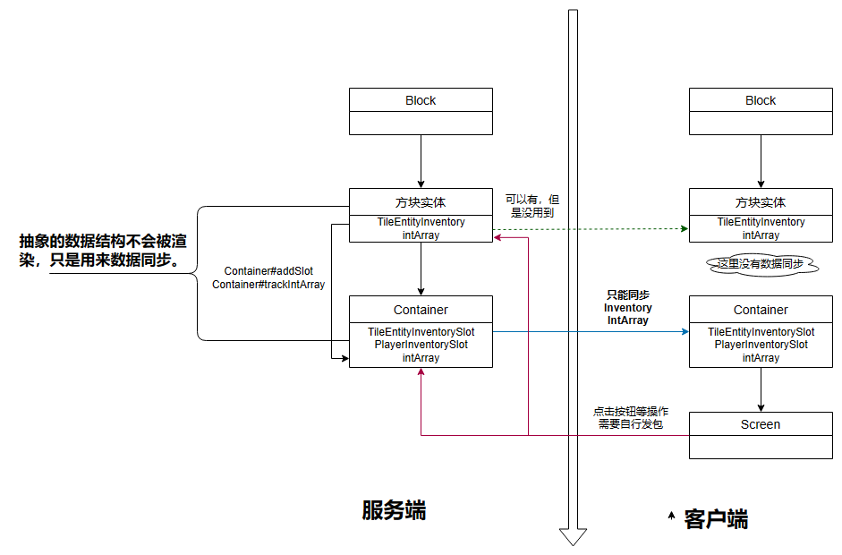

# 参考
https://boson.v2mcdev.com/gui/container.html

## MENU
好了上一次的视频中，我们讲解了gui，不过上次的教程的GUI还是和单薄的，实现的功能有限，更适合做一些界面的操作。在这次的视频中我们讲解怎么做一个能存放一的物品的类似箱子的内容。

那么和这次有关的类是screen，menu。这两个主要的类，和一些这两个类用到的其他的类。

在上次的Screen创建的GUI中，他的代码仅仅在客户端可以使用，如果你的逻辑要在服务器做一些操作，那么只能通过发包的方式进行操作。不过这次我们的说的内容menu，它自带了一些数据同步功能。

我们讲解下Menu，他与screen的关系有点类似block和blockentitiy的关系，不过并不相同，menu是screen的逻辑实现的类，menu用来存储临时数据的以及数据同步的`（所以你的最后在那个数据还是需要存在blockentitiy中）`，不会进行渲染，而渲染还是通过screen类进行，利用menu的同步机制能同步itemhandler这样的inventory和containerdata这样的数据。对于更加复杂的内容，也只能通过发包来解决了。

好了这里借用boson的一张图来了解下对于的menu和screen的之间的关系。



通过这张图你应该明白客户端额数据仅仅用于展示的，所以你不要更改这些数据，如果要实现一些按钮点击的操作，请采用发包的方法解决，对于menu也就是图里面的container是可以自己同步slot的数据和containerdata的这部分不需要你处理。

这次我们做一个只有一个格子的箱子。

想来看下block的代码吧。

```java
public class FirstMenuBlock extends BaseEntityBlock {
    public FirstMenuBlock() {
        super(BlockBehaviour.Properties.ofFullCopy(Blocks.STONE));
    }

    @Override
    protected MapCodec<? extends BaseEntityBlock> codec() {
        return null;
    }

    @Nullable
    @Override
    public BlockEntity newBlockEntity(BlockPos pPos, BlockState pState) {
        return new FirstMenuBlockEntity(pPos,pState);
    }

    @Override
    public InteractionResult use(BlockState pState, Level pLevel, BlockPos pPos, Player pPlayer, InteractionHand pHand, BlockHitResult pHit) {
        if (!pLevel.isClientSide){
            //打开menu
            //值得说的就是这里，这里是打开Menu的操作，需要你传入一个试下你了MenuProvider的类，对于我们的blockentitiy当然的实现的，所以可以直接返回。需要将pos位置也传入
            // 当然对于openMenu方法也有重载的不需要pos的方法，自己挑选合适即可
            // 我们调用getmenprovider这方法返回对应的blockentity，这个方法很简单，自己点开查看下吧。
            pPlayer.openMenu(this.getMenuProvider(pState,pLevel,pPos),pPos);
        }
        return super.use(pState, pLevel, pPos, pPlayer, pHand, pHit);
    }

    @Override
    public RenderShape getRenderShape(BlockState pState) {
        return RenderShape.MODEL;
    }
    
    @Nullable
    @Override
    public <T extends BlockEntity> BlockEntityTicker<T> getTicker(Level level, BlockState state,BlockEntityType<T> type) {
        return level.isClientSide ? null : createTickerHelper(type, ModBlockEntities.FIRST_MENU_BLOCK_ENTITY.get(),
                FirstMenuBlockEntity::serverTick);
    }
}

```
不过还是要说一些内容是关于menu的创建方式对于客户端和服务器是不同的， 所以的这里直接引用了boson的教程的内容。

>当你执行这条命令时，Minecraft会同时在客户端和服务端各自创建一个Container，并且创建的流程不一样。我们来讲一下这个创建的流程时什么样子的。
> - 服务端：这个函数的第二个参数是是一个INamedContainerProvider接口，这里我们让我们的方块实体实现了这个接口（大部分时候你都应该这么做）。这个接口下有个叫做createMenu的方法，在服务端最终会调用这个方法来创建Container。
> - 客户端：客户端的操作首先会进行一次发包处理，NetworkHooks.openGui方法的第三个参数让你可以在发送的数据包中额外的附加数据（为了方便展示，我没有使用内置的封装好的函数），这里添加数据的方法，相信已经会自定义网络包的你，理解起来不难。

那么其实openmenu的第二个的pos就是发包的附加数据，而调用的构造在menu的第一个方法，之后我们再说。

当客户端接受到发送来的包之后，客户的会调用你在注册时设置的构造方法创建，具体的内容我们留到注册部分再说

下面来看看blockentity类

对于方块实体，我们应该继承Blockentity类，由于有Menu所有我们要实现这个provider的接口。实现这个接口之后你需要实现两个方法，一个是getDisplayName的方法，另一个就是返回对应的menu的方法createMenu。

```java

public class FirstMenuBlockEntity extends BlockEntity implements MenuProvider {
    // i 是我们举例子使用containerdata同步的数据，在实际中可以用来同步进度条。
    int i = 0;
    // 数据同步的工具详细的实现在下面。
    protected final ContainerData data;
    // itemhandler 是我们处理物品的地方，itemstack存放在这里。
    // 参数1表示1个slot，也就是一个格子的箱子。
    private final ItemStackHandler itemHandler = new ItemStackHandler(1);
    public FirstMenuBlockEntity(BlockPos pPos, BlockState pBlockState) {
        super(ModBlockEntities.FIRST_MENU_BLOCK_ENTITY.get(), pPos, pBlockState);
        // data实现在这里
        this.data = new ContainerData() {
            // 通过data获得对应的数值，通过index获得，
            // 如果index是0，那么要查找的就是i。返回i数值即可
            //如果是多个，那么就在这里添加多个if或者swtich判断条件。
            @Override
            public int get(int pIndex) {
                if (pIndex==0){
                    return i;
                }
                return 0;
            }
            // 设置同步的数值，index索引，value数值
            @Override
            public void set(int pIndex, int pValue) {
                if(pIndex==0){
                    //这里由于闭包，所以通过FirstMenuBlockEntity才能拿到FirstMenuBlockEntity类的this指针。
                    FirstMenuBlockEntity.this.i = pValue;
                }
            }

            @Override
            public int getCount() {
                // 你的container中的同步的数据的数量。要保持一致
                return 1;
            }
        };
    }
    //menuprovider要求实现的方法，这里返回你的menu的一个名称，也需要国家化处理。
    @Override
    public Component getDisplayName() {
        return Component.translatable("gui."+ExampleMod.MODID+".first_menu_gui");
    }
    // 创建了我们的Container
    // 这里的创建是服务端的创建。
    @Nullable
    @Override
    public AbstractContainerMenu createMenu(int pContainerId, Inventory pPlayerInventory, Player pPlayer) {
        return new FirstMenu(pContainerId,pPlayerInventory,this,this.data);
    }
    // 数据保存和回复
    @Override
    public void load(CompoundTag pTag) {
        super.load(pTag);
        CompoundTag inventory = pTag.getCompound("inventory");
        this.itemHandler.deserializeNBT(inventory);
    }

    @Override
    protected void saveAdditional(CompoundTag pTag) {
        super.saveAdditional(pTag);
        pTag.put("inventory",this.itemHandler.serializeNBT());
    }
    // 帮助我们获得itemhandler的方法，我们在screen中会使用
    public ItemStackHandler getItemHandler(){
        return this.itemHandler;
    }
    //servertick方法。
    public static void serverTick(Level pLevel, BlockPos pPos, BlockState pState, FirstMenuBlockEntity pBlockEntity) {
        if(pLevel!=null && !pLevel.isClientSide){
            // 很简单就是在服务端设置i的数值为放入的物品的堆叠数量，
            pBlockEntity.data.set(0,pBlockEntity.itemHandler.getStackInSlot(0).getCount());
        }
    }
}
```

下面我们来看我们的menu的内容

```java
// 我们需要继承AbstractContainerMenu来实现我们的menu
public class FirstMenu extends AbstractContainerMenu {
    // 同步的data，等会我们给他赋值
    private final ContainerData data;
    // 还记得我们说过的对于menu存在两个端的调用吗，这一个构造就是我们给客户端调用的，也就是注册时候用的，当我们调用openmenu时候，服务端会发包给客户端，客户端调用我们注册的这个方法。
    // buf的内容就是我们写入的pos
    public FirstMenu(int pContainerId, Inventory inv, FriendlyByteBuf buf) {
        this(pContainerId,inv,inv.player.level().getBlockEntity(buf.readBlockPos()),new SimpleContainerData(1));
    }
    // 这个就是我们blockentity中create返回的方法。
    public FirstMenu(int pContainerId, Inventory inv, BlockEntity entity, ContainerData data) {
        //构造这是使用到了MenuType和EntitiyType一样要是对Menu的注册，我们之后注册讲
        super(ModMenuTypes.FIRST_MENU.get(), pContainerId);
        // 检查slot的多少
        checkContainerSize(inv,1);
        // 赋值data
        this.data = data;
        FirstMenuBlockEntity firstMenuBlockEntity = (FirstMenuBlockEntity) entity;
        ItemStackHandler itemHandler = firstMenuBlockEntity.getItemHandler();
        // 添加一个slot在menu上。
        this.addSlot(new SlotItemHandler(itemHandler,0,80,32));
        // 添加data 用于数据同步的。 
        addDataSlots(data);
        // 添加玩家背包和热键栏的slot，关于slot的讲解在下面。
        layoutPlayerInventorySlots(inv);
    }
    //这个是你按住shift点击物品快速移动的，这里没有实现
    @Override
    public ItemStack quickMoveStack(Player pPlayer, int pIndex) {
        return ItemStack.EMPTY;
    }
    // 这个是验证你的打开这个界面是否是合法的，我们直接返回了true，你可以参考其他的menu这个是怎么实现的。
    @Override
    public boolean stillValid(Player pPlayer) {
        return true;
    }
    // 添加玩家背包的slot和热键的栏的slot
    private void layoutPlayerInventorySlots(Inventory playerInventory) {
        // Player inventory
        for (int i = 0; i < 3; ++i) {
            for (int l = 0; l < 9; ++l) {
                this.addSlot(new Slot(playerInventory, l + i * 9 + 9, 8 + l * 18, 84 + i * 18));
            }
        }

        // Hotbar
        for (int i = 0; i < 9; ++i) {
            this.addSlot(new Slot(playerInventory, i, 8 + i * 18, 142));
        }
    }
    // 给scrren获得data用的一个辅助的方法
    public ContainerData getContainerData(){
        return this.data;
    }
}
```

这里使用boson的图，大家就明白slot是什么东西了。


最后是我们的screen

```java
// 继承AbstractContainerScreen来实现我们带有container的GUI
public class FistMenuGui extends AbstractContainerScreen<FirstMenu> {
    // 界面图片的位置
    private final ResourceLocation OBSIDIAN_CONTAINER_RESOURCE = new ResourceLocation(ExampleMod.MODID, "textures/gui/container.png");
    //图片的大小
    private final int textureWidth = 176;
    private final int textureHeight = 166;
    //构造
    public FistMenuGui(FirstMenu pMenu, Inventory pPlayerInventory, Component pTitle) {
        super(pMenu, pPlayerInventory, pTitle);
    }
    // 初始化
    @Override
    protected void init() {
        super.init();
    }
    // 渲染label，在这里实现渲染你的按钮，提示信息等
    @Override
    protected void renderLabels(GuiGraphics pGuiGraphics, int pMouseX, int pMouseY) {
        //这里我们将slot中的itemstack的堆叠数量取出，渲染在界面上。
        // 其中参数含义和上一个教程讲得一样。
        super.renderLabels(pGuiGraphics, pMouseX, pMouseY);
        pGuiGraphics.drawString(this.font,Component.literal(this.menu.getContainerData().get(0)+""),82,20,0xeb0505);
    }
    // 这里渲染你的图片
    @Override
    protected void renderBg(GuiGraphics pGuiGraphics, float pPartialTick, int pMouseX, int pMouseY) {
        RenderSystem.setShader(GameRenderer::getPositionTexShader);
        RenderSystem.setShaderColor(1.0F, 1.0F, 1.0F, 1.0F);
        int x = (width - imageWidth) / 2;
        int y = (height - imageHeight) / 2;
        // 渲染图片
        pGuiGraphics.blit(OBSIDIAN_CONTAINER_RESOURCE,x,y,0,0,this.textureWidth,this.textureHeight,this.textureWidth,this.textureHeight);

    }
    // 为了能让我们的GUI渲染物品的提示信息，所以调用下renderTooltip
    @Override
    public void render(GuiGraphics pGuiGraphics, int pMouseX, int pMouseY, float pPartialTick) {
        renderBackground(pGuiGraphics,pMouseX,pMouseY,pPartialTick);
        super.render(pGuiGraphics, pMouseX, pMouseY, pPartialTick);
        renderTooltip(pGuiGraphics,pMouseX,pMouseY);
    }
}

```

下面我们注册我们的menu和screen，对于方块和方块实体的注册就不讲了。 

```java
public class ModMenuTypes {
    // 照旧
    public static final DeferredRegister<MenuType<?>> MENU_TYPES = DeferredRegister.create(Registries.MENU, ExampleMod.MODID);
    // 照旧，不一样的地方是我们需要一个辅助函数
    public static final Supplier<MenuType<FirstMenu>> FIRST_MENU =registerMenuType(FirstMenu::new,"first_menu");
    // 我们的辅助函数
    // 我们需要通过IMenuTypeExtension的.create方法才能返回一个menutype，
    // create方法需要传入一个IContainerFactory的内容，而正好我们的构造函数就是IContainerFactory一样的参数。
    // 因为就是这样设计的， 所以传入new就可以了。   
    private static <T extends AbstractContainerMenu> Supplier<MenuType<T>> registerMenuType(IContainerFactory<T> factory,
                                                                                            String name) {
        return MENU_TYPES.register(name, () -> IMenuTypeExtension.create(factory));
    }
    public static void register(IEventBus eventBus){
        MENU_TYPES.register(eventBus);
    }
}

```

screen的注册比较简单。

```java
@Mod.EventBusSubscriber(bus = Mod.EventBusSubscriber.Bus.MOD,value = Dist.CLIENT)
public class ClientEventHandler {
    @SubscribeEvent
    public static void onClientEvent(FMLClientSetupEvent event){
        event.enqueueWork(()->{
            // 传入对应的menu和screen的构造即可
            MenuScreens.register(ModMenuTypes.FIRST_MENU.get(),FistMenuGui::new);
        });
    }
}
```

记得注册到总线

```java
        ModMenuTypes.register(modEventBus);

```

好了你可以进入游戏查看这个方块了 。