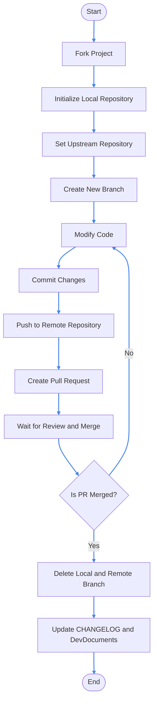

# Git Tutorial

> This article provides a brief overview of how to initialize a project and collaborate on development using Git command line.

> You need [Git](https://git-scm.com/downloads) for collaborative development.

## Initialize the Project

1. **Fork the project:**

Open the repository of the project you want to make content modifications to. In this example, we will use CrychicDoc.

Open the [CrychicDoc repository](https://github.com/CrychicTeam/CrychicDoc), click on the "Fork" button in the top right corner to fork the project to your GitHub account.

2. **Initialize the repository:**

Open the command line or terminal or directly execute the following commands in your project folder:

> Github/gitee links of CrychicDoc for cooperation, if you want to provide code for other projects, please refer to the third item.

> [!CAUTION] Caution
> **Please refer to the instructions in the comments to modify the commands, do not copy and paste.**

::: code-group
```bash [git]
# Replace with the actual folder address.
# In this case, enter the folder where you want to store the CrychicDoc code.
cd path/to/your/project
git init # [!code focus]
# In this example, for CrychicDoc, you need to modify the repository code after forking.
# Replace YourUsername with your Github ID, you can directly use the forked repository link.
git remote add origin https://github.com/YourUserName/CrychicDoc.git # [!code focus]
git pull origin main # [!code focus]
```

```bash [git]
# Replace with the actual folder address.
# In this case, enter the folder where you want to store the CrychicDoc code.
cd path/to/your/project
git init # [!code focus]
# In this example, for CrychicDoc, you need to modify the repository code after forking.
# Replace YourUsername with your Github ID, you can directly use the forked repository link.
git remote add origin https://gitee.com/YourUsername/CrychicDoc.git # [!code focus]
git pull origin main # [!code focus]
```

```bash [git]
# Replace with the actual folder address.
# In this case, enter the folder where you want to store the CrychicDoc code.
cd path/to/your/project
git init # [!code focus]
# In this example, for CrychicDoc, you need to modify the repository code after forking.
# Replace YourUsername with your Github ID, you can directly use the forked repository link.
git remote add origin https://github.com/YourUsername/TheNameOfRepo.git # [!code focus]
git pull origin main # [!code focus]
```
:::

3. **Set up the upstream repository:**

To keep in sync with the original repository, set up the upstream repository:

::: code-group
```bash [git]
git remote add upstream https://github.com/CrychicTeam/CrychicDoc.git
```
:::

By the way, don't forget to disable ignorecase to make Git case-sensitive.
::: code-group
```bash [git]
Git config core.ignorecase false
```
:::

## Collaboration Workflow

4. **Create and switch to a new branch:**

First, it is recommended to create a new feature branch from the main branch:

::: code-group
```bash [git]
git checkout -b feature-branch
```
:::

5. **Modify the code:**

In your Minecraft instance folder, edit the project's code, resource files, or configuration files and make the necessary modifications and adjustments according to your needs.

6. **Commit the changes:**

After saving the modifications, use the following command to commit the changes to your local repository:

::: code-group
```bash [git]
# Using 'git add .' should generally work fine, but you can replace '.' with the specific file path for added safety.
git add .
git commit -m "Describe your modifications"
```
:::

7. **Push to the remote repository:**

If you are ready to merge your changes into the main branch, push your local branch to the remote repository:

::: code-group
```bash [git]
git push
```
:::

## Submitting a Pull Request (PR)

8. **Create a Pull Request:**

Open your forked GitHub repository page, select the feature branch you just pushed, click on "Compare & pull request", fill in the relevant information, and submit the PR.

9. **Wait for review and merge:**

It is recommended to inform the developers in advance before submitting.

## Ending Collaboration

10. **Delete local and remote branches:**

Once your PR is merged, you can safely delete the feature branch you created:

::: code-group
```bash [git]
git checkout main
git branch -d feature-branch # Delete local branch
git push origin --delete feature-branch # Delete remote branch
```
:::

::: details Workflow Diagram
<ClientOnly>



</ClientOnly>

:::

## Guidelines

Every time you perform the above steps, if your repository is behind the original repository, click the "Sync fork" button to synchronize the progress.

::: details
> If you are contributing to Crychic's Minecraft-Hunt project, when you complete a task, you need to write your contribution in the CHANGELOG and DevDocuments.<br/>
> If you are an external developer contributing any content, materials, or documentation to CrychicDoc, please leave your signature after adding the item. Thank you for your contribution.<br/>
> If you would like to standardize your attribution in CrychicDoc, please contact us for more information.<br/>
> For example: I completed this change => 2024/Month/Day - My Name<br/>
:::

:::v-success Congratulations!
You are now a Pull Request master!
:::
