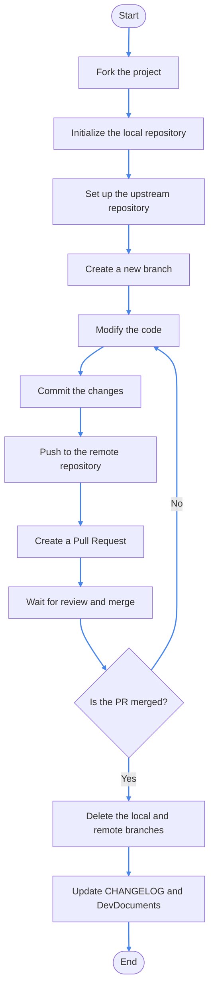

# Project Collaboration Tutorial

> This document provides a brief overview of how to initialize a project and collaborate using Git command line.

> You will need [Git](https://git-scm.com/downloads) for collaborative development.

## Initialize the Project

1. **Fork Project:**

Open the repository of the project you want to modify, below is an example using CrychicDoc.

Open the [CrychicDoc repository](https://github.com/M1hono/CrychicDoc), click on the "Fork" button at the top right corner to fork the project to your GitHub account.

2. **Initialize Repository:**

Open a command line or terminal or directly execute the following commands in your project folder:

```bash
# Modify to actual folder path such as .minecraft or version name inside launcher, or any empty folder you choose.
# In this case, enter the folder where you want to store the CrychicDoc code.
cd path/to/your/project
git init
# Using CrychicDoc as an example here, if you want to provide code for it, modify after pulling forked repository code.
# Replace YourUsername with your GithubID, you can use direct link of forked repository.
git remote add origin https://github.com/YourUsername/CrychicDoc.git
git pull origin main
```

3. **Set up the upstream repository:**

To keep in sync with the original repository, set up the upstream repository:

```bash
git remote add upstream https://github.com/M1hono/CrychicDoc.git
```

## Collaboration Workflow

4. **Create and switch to a new branch:**

First, it is recommended to create a new feature branch from the main branch:

```bash
git checkout -b feature-branch
```

5. **Modify the code:**

In your Project folder, edit the project's code, resource files, or configuration files and make the necessary modifications and adjustments according to your needs.

6. **Commit the changes:**

After saving the modifications, use the following command to commit the changes to your local repository:

```bash
# Generally, using 'git add .' should work fine, but you can replace '.' with the specific file path for extra caution.
git add .
git commit -m "Describe your modifications"
```

7. **Push to the remote repository:**

If you are ready to merge your changes into the main branch, push your local branch to the remote repository:

```bash
git push
```

## Submitting a Pull Request (PR)

8. **Create a Pull Request:**

Open your forked GitHub repository page, select the feature branch you just pushed, click "Compare & pull request," fill in the relevant information, and submit the PR.

9. **Wait for review and merge:**

It is recommended to inform the developers in advance before submitting.

## Ending Collaboration

10. **Delete the local and remote branches:**

Once your PR is merged, you can safely delete the created feature branch:

```bash
git checkout main
git branch -d feature-branch # Delete the local branch
git push origin --delete feature-branch # Delete the remote branch
```

<ClientOnly>



</ClientOnly>

## Guidelines

Whenever you perform the above steps, if your repository is behind the original repository, click the `Sync fork` button to synchronize the progress.


::: details
> If you are contributing to the Crychic Minecraft-Hunt project, when you complete a task, make sure to write your contribution in the CHANGELOG and DevDocuments.

> If you are an external developer contributing any content, materials, or documentation to Crychic, especially CrychicDoc, please leave your signature after adding the item. Thank you for your contribution.

> If you would like to standardize your attribution in CrychicDoc, please contact us.

> For example: I completed this change => 2024/Month, Day - My Name
:::


  <v-alert
    text="You are now a Pull Request master!"
    title="Congratulations!"
    type="success"
  ></v-alert>
