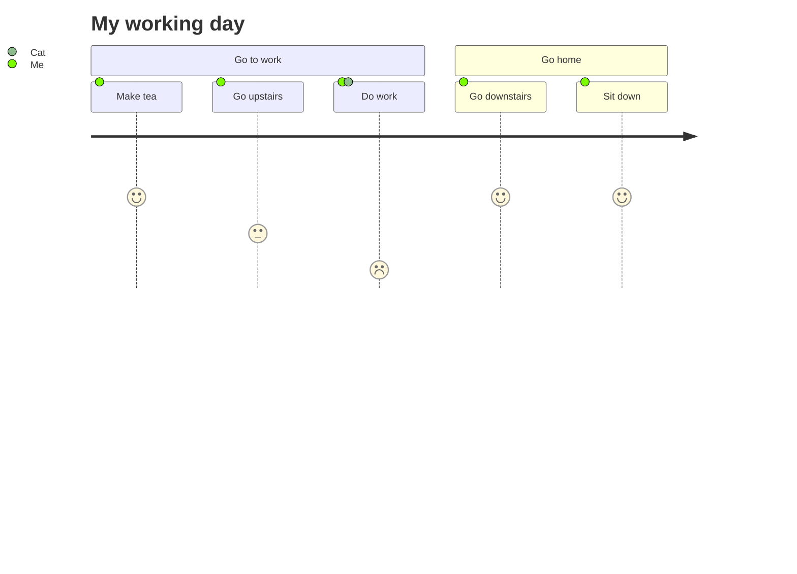

## Mermaid Sample

:::demo

:::

## Timeline plugin sample

:::demo
::: timeline 2023-05-24
- **do some thing1**
- do some thing2
:::

::: timeline 2023-05-23
do some thing3
do some thing4
:::
:::

## Magic Move

:::magic-move
```js [KubeJS]
BlockEvents.rightClicked("minecraft:oak_planks", (event) => {
    let player = event.getPlayer();
    if (event.getBlock().is("stone")) {
        let spawnItem = event.getLevel().createEntity("item");
        player.give("diamond");
    }
});
```
```java [Forge]
@SubscribeEvent
public void onBlockRightClick(PlayerInteractEvent.RightClickBlock event) {
  if (event.getWorld().getBlockState(event.getPos()).getBlock() == Blocks.STONE) {
    event.getPlayer().addItemStackToInventory(new ItemStack(Items.DIAMOND));
  }
}
```
:::

## Youtube Video sample

:::demo
<YoutubeVideo videoId="IL7J9ueYRYc" />
:::

## Damage Static chart

:::demo
<DamageChart
  mode="static"
  :incomingDamage="20"
  :armorToughness="5"
  :minDamage="4"
  :maxDamage="20"
  :maxArmorPoints="20"
  :isJavaEdition="true"
/>
:::

## PDF Viewer

:::demo
<PdfViewer pdfSource="/pdf/modding/java/test.pdf"/>
:::

## File Tree

### Basic File Tree

:::demo Basic Example
<LiteTree>
Company A
    Administrative Center
        CEO Office
        Human Resources      //+         Added
        Finance             //+         Added  
        Administration      //+         Added
        Legal
        Audit               //x         Error
        IT Center           //v         Success
    Marketing Center
        Marketing
        Sales               //-         Removed
        Customer Service    //-         Removed
        Brand               //-         Removed
        Marketing Planning
        Marketing Operations //!        Important
    R&D Center
        Mobile Development
        Platform Development //*        Modified
        Testing             //*        Modified
        Operations          //*        Modified
        Product
        Design
</LiteTree>
:::

### File Tree with Variables and Styling

:::demo Advanced Styling Example
<LiteTree>
// Define style variables
#important=color:red;font-weight:bold;background:#ffe6e6;padding:2px 6px;border-radius:3px;
#success=color:green;font-weight:bold;background:#e6ffe6;padding:2px 6px;border-radius:3px;
#warning=color:orange;background:#fff3e0;padding:2px 6px;border-radius:3px;
.folder=color:#1976d2;font-weight:500;
.file=color:#666;
// Define icon variables
folder=data:image/svg+xml;base64,PHN2ZyB4bWxucz0iaHR0cDovL3d3dy53My5vcmcvMjAwMC9zdmciIHdpZHRoPSIxZW0iIGhlaWdodD0iMWVtIiB2aWV3Qm94PSIwIDAgMjQgMjQiPjxwYXRoIGZpbGw9ImN1cnJlbnRDb2xvciIgZD0iTTEwIDRIOGEyIDIgMCAwIDAtMiAydjEyYTIgMiAwIDAgMCAyIDJoOGEyIDIgMCAwIDAgMi0yVjhhMiAyIDAgMCAwLTItMmgtM2wtMi0yWiIvPjwvc3ZnPg==
file=data:image/svg+xml;base64,PHN2ZyB4bWxucz0iaHR0cDovL3d3dy53My5vcmcvMjAwMC9zdmciIHdpZHRoPSIxZW0iIGhlaWdodD0iMWVtIiB2aWV3Qm94PSIwIDAgMjQgMjQiPjxwYXRoIGZpbGw9ImN1cnJlbnRDb2xvciIgZD0iTTE0IDJINmEyIDIgMCAwIDAtMiAydjE2YTIgMiAwIDAgMCAyIDJoMTJhMiAyIDAgMCAwIDItMlY4bC02LTZtNCA5VjlsNCA0aC00WiIvPjwvc3ZnPg==
js=data:image/svg+xml;base64,PHN2ZyB4bWxucz0iaHR0cDovL3d3dy53My5vcmcvMjAwMC9zdmciIHdpZHRoPSIxZW0iIGhlaWdodD0iMWVtIiB2aWV3Qm94PSIwIDAgMjQgMjQiPjxwYXRoIGZpbGw9IiNmN2RmMWUiIGQ9Ik0zIDNoMTh2MThIM1ptMTYuNTI1IDE0LjVjLS4zLS4zNTQtLjc5NS0uNjI5LTEuNzE3LS42MjljLS44ODEgMC0xLjQzOS4zMTgtMS40MzkuNzE4YzAgLjM5Ni4zNzMuNjM3IDEuMTU2Ljk2N2MxLjMzMi41ODYgMi4yODEgMS4wOTMgMi4yODEgMi4zOGMwIDEuMzItMS4yMDMgMi4xNDMtMi45NzQgMi4xNDNjLTEuMjEzIDAtMi4yNzEtLjQ2Mi0yLjk1LTEuMDc0bC44NzUtMS4yNzNjLjQzMy4zODkgMS4wNjQuNzI0IDEuNjY0LjcyNGMuNzA2IDAgMS4wNjQtLjMzMSAxLjA2NC0uNzMzYzAtLjQ0OS0uMzc2LS43MjQtMS4yNDUtMS4wMzNjLTEuMzI1LS40ODgtMi4xMzItMS4yNS0yLjEzMi0yLjM2M2MwLTEuMzk0IDEuMDI5LTIuMTQzIDIuODU2LTIuMTQzYzEuMDY0IDAgMS43NDUuMzI4IDIuMzc3Ljg1OWwtLjgzIDEuMjQxWm0tNS44NDUtLjMzNWMuMzY2LjgxNS4zNjYgMS41NzcuMzY2IDIuNDd2My45MDZoLTEuODc2VjE5LjZjMC0xLjUyNy0uMDYtMi4xOC0uNTUtMi40OGMtLjQxLS4yODgtMS4wNzYtLjI3NC0xLjYxOC0uMTA3Yy0uMzc4LjExNy0uNzEzLjMzNS0uNzEzIDEuMDc0djUuMDU2SDYuNDI3VjEyLjgyaDEuODc2djIuMTEzYy43NDctLjM5OSAxLjU3Ny0uNzM4IDIuNjQ1LS43MzhjLjc2NCAwIDEuNTc3LjI1MyAyLjA2OS43ODdjLjQ5OC41NTIuNjI2IDEuMTU3LjcyMyAxLjk5MVoiLz48L3N2Zz4=
---
[folder] {.folder}Frontend Project
    [folder] {.folder}src
        [folder] {.folder}components
            [file] {.file}Header.vue     // {#success}Completed
            [file] {.file}Footer.vue     // {#success}Completed
            [file] {.file}Sidebar.vue    // {#warning}In Progress
        [folder] {.folder}pages
            [file] {.file}Home.vue       // {#success}Completed
            [file] {.file}About.vue      // {#important}Needs Refactor
        [folder] {.folder}utils
            [js] {.file}api.js          // {#success}Completed
            [js] {.file}helpers.js      // {#warning}Needs Optimization
    [file] {.file}package.json
    [file] {.file}README.md            // {#important}Needs Documentation Update
</LiteTree>
:::

### Standard Markers Example

:::demo Marker Explanation
<LiteTree>
Project Status Check
    Completed Features  //v    Success marker (green checkmark)
    New Features        //+    Added marker (green plus)
    Removed Features    //-    Removed marker (red minus)
    Errors Found        //x    Error marker (red X)
    Modified Files      //*    Modified marker (orange asterisk)
    Important Items     //!    Important marker (red exclamation)
</LiteTree>
:::

### Inline Styling Example

:::demo Inline Color Styling
<LiteTree>
Project Components
    {color:green;font-weight:bold}Completed Components
    {color:orange}Components in Progress  
    {color:red}Components with Issues
    {color:blue;background:#e3f2fd;padding:2px 4px;border-radius:2px}Special Components
</LiteTree>
:::

### Project Structure Example

:::demo Project Structure
<LiteTree>
// Style definitions
#new=color:white;background:#4caf50;padding:1px 4px;border-radius:2px;font-size:12px;
#deprecated=color:white;background:#f44336;padding:1px 4px;border-radius:2px;font-size:12px;
.important=font-weight:bold;color:#1976d2;
// Icon definitions
vue=data:image/svg+xml;base64,PHN2ZyB4bWxucz0iaHR0cDovL3d3dy53My5vcmcvMjAwMC9zdmciIHdpZHRoPSIxZW0iIGhlaWdodD0iMWVtIiB2aWV3Qm94PSIwIDAgMjQgMjQiPjxwYXRoIGZpbGw9IiM0Y2FmNTAiIGQ9Ik0yIDIwaDIwTDEyIDR6Ii8+PC9zdmc+
ts=data:image/svg+xml;base64,PHN2ZyB4bWxucz0iaHR0cDovL3d3dy53My5vcmcvMjAwMC9zdmciIHdpZHRoPSIxZW0iIGhlaWdodD0iMWVtIiB2aWV3Qm94PSIwIDAgMTUgMTUiPjxwYXRoIGZpbGw9Im5vbmUiIHN0cm9rZT0iIzMxNzhDNiIgZD0iTTEyLjUgOHYtLjE2N2MwLS43MzYtLjU5Ny0xLjMzMy0xLjMzMy0xLjMzM0gxMGExLjUgMS41IDAgMSAwIDAgM2gxYTEuNSAxLjUgMCAwIDEgMCAzaC0xQTEuNSAxLjUgMCAwIDEgOC41IDExTTggNi41SDNtMi41IDBWMTNNMS41LjVoMTN2MTRIOS41eiIvPjwvc3ZnPg==
---
CrychicDoc
    .vitepress
        config           // {.important}Configuration directory
            index.ts     // {#new}New configuration
        plugins          // {.important}Plugins directory
            [ts] custom-alert.ts    // {#new}Custom alert plugin
            [ts] dialog.ts          // {#new}Dialog plugin
        theme
            [vue] components        // {.important}Component library
                [vue] CustomAlert.vue    // {#new}Alert component
                [vue] Dialog.vue         // {#new}Dialog component
    docs
        zh               // Chinese documentation
            styleList.md // {#deprecated}Needs update
        en               // English documentation
            samples.md   // {#new}Sample documentation
    [file] package.json
    [file] README.md     // {.important}Project description
</LiteTree>
:::