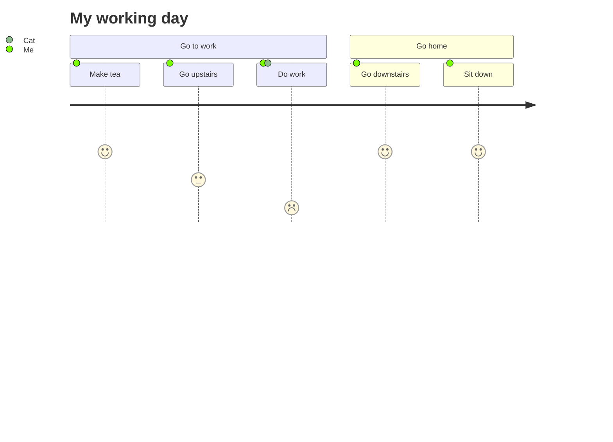

## Mermaid Sample

<ClientOnly>

## Timeline plugin sample.

</ClientOnly>

::: timeline 2023-05-24
- **do some thing1**
- do some thing2
:::

::: timeline 2023-05-23
do some thing3
do some thing4
:::

## Youtube Video sample

<YoutubeVideo videoId="IL7J9ueYRYc" />

## Damage Static chart

<ClientOnly>
<!--  -->
<DamageChart
  mode="static"
  :incomingDamage="20"
  :armorToughness="5"
  :minDamage="4"
  :maxDamage="20"
  :maxArmorPoints="20"
  :isJavaEdition="true"
/>
</ClientOnly>