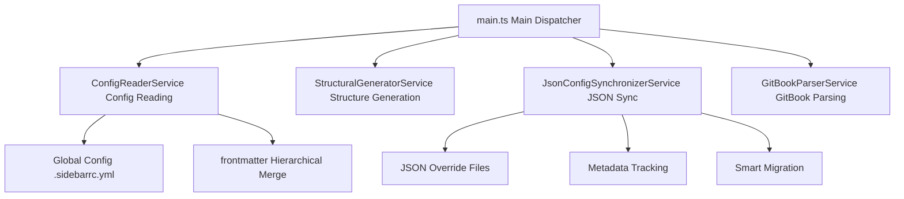
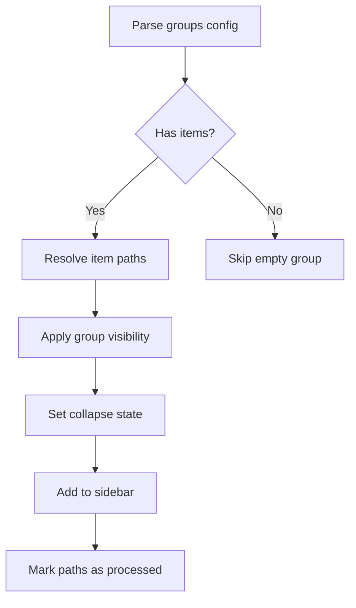
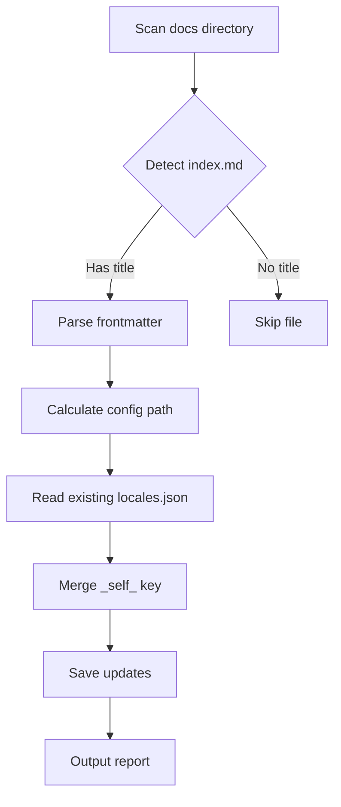
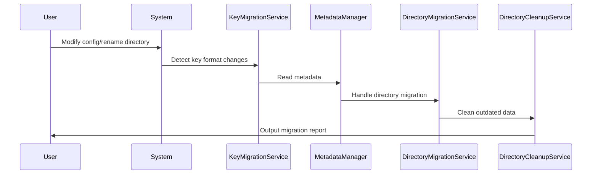

# VitePress Sidebar Generator Configuration Guide {#guide}

## Overview {#info}

This site uses a self-developed intelligent sidebar generation system that supports automatic discovery, configuration inheritance, JSON overrides, and intelligent migration features. This document provides a detailed explanation of the system architecture and configuration methods.

## System Architecture {#architecture}

### Core Service Components



### Automatic Root Node Discovery

When `index.md` in a directory contains the following configuration:

```yaml
---
root: true # Enable root node mode
title: Development Guide # Sidebar group title
---
```

The system will automatically:

1. 🔍 **Scan & Discover**: Find all root nodes through `findAllRootIndexMdPaths()`
2. 📂 **Create Groups**: Generate independent sidebar groups for each root node
3. ⚙️ **Merge Configs**: Apply global config, hierarchical frontmatter, and JSON overrides
4. 🗂️ **Structure Flattening**: Display subdirectory content directly, avoiding deep nesting

### File Scanning Rules {#scan-rules}

Based on the actual implementation of `findAllRootIndexMdPaths()` in `main.ts`:

#### ✅ Included Files

- All `.md` files (except system reserved files)
- `index.md` files in subdirectories
- `SUMMARY.md` files from GitBook projects

#### 🚫 Auto-ignored Items

```typescript
// Ignore rules based on actual implementation
const ignorePatterns = [
    "**/.vitepress/**", // VitePress system directory
    "**/node_modules/**", // Node modules
    "**/_*/**", // Private directories starting with underscore
    langGitbookPaths, // GitBook directories (handled separately)
];
```

#### 🎯 Deep Nesting Filter

The system automatically filters overly nested root nodes:

```typescript
// Prevent conflicts from deeply nested root nodes
const isMuchDeeper = depthFromLang > otherDepthFromLang + 2;
if (isWithinOther && isMuchDeeper) {
    // Filter out deeply nested root nodes
}
```

## Configuration System {#config-system}

### Configuration Priority (Actual Merge Order)


### frontmatter Configuration {#frontmatter}

Complete configuration options based on the `DirectoryConfig` interface in `types.ts`:

| Config Field | Purpose | Type | Default | Implementation Location |
|-------------|---------|------|---------|------------------------|
| `root` | Create independent sidebar root node | boolean | `false` | main.ts |
| `title` | Set display title | string | Directory name | ConfigReaderService |
| `hidden` | Content visibility | boolean | `false` | EffectiveDirConfig |
| `priority` | Sorting priority | number | 0 | configDefaultsProvider |
| `maxDepth` | Maximum scan depth | number | 3 | Global config |
| `collapsed` | Default collapse state | boolean | `false` | JSON override |
| `itemOrder` | Child item sorting rules | Record<string,number> | `{}` | Config merge |
| `groups` | Group configuration | GroupConfig[] | `[]` | StructuralGenerator |

#### Configuration Inheritance Rules

```typescript
// Based on actual implementation in ConfigReaderService.ts
for (const hIndexMdPath of hierarchyIndexMdPaths) {
    const frontmatter = await this.getFrontmatter(hIndexMdPath);
    const { root: _, ...frontmatterWithoutRoot } = frontmatter; // Exclude root inheritance
    mergedConfig = deepMerge(mergedConfig, frontmatterWithoutRoot);
}
```

**Note**: The `root` property is not inherited by subdirectories; it only takes effect in the directory where it's declared.

### itemOrder Configuration {#itemorder}

Based on the actual implementation in `itemSorter.ts`, supports both array and object formats:

#### Array Format (Index-based)
```yaml
---
itemOrder: ["setup.md", "guide.md", "api.md"]
---
```

#### Object Format (Priority-based)  
```yaml
---
itemOrder:
  "setup.md": 1
  "guide.md": 2
  "advanced/": 3
  "api.md": 4
---
```

#### Sorting Implementation Logic

```typescript
// Based on actual sortItems() implementation
function sortItems(items: SidebarItem[], itemOrder?: ItemOrder): SidebarItem[] {
    return items.sort((a, b) => {
        const orderA = getItemPriority(a._relativePathKey, itemOrder);
        const orderB = getItemPriority(b._relativePathKey, itemOrder);
        
        if (orderA !== orderB) return orderA - orderB;
        
        // Fallback to priority field, then alphabetical
        const priorityA = a._priority ?? DEFAULT_PRIORITY;
        const priorityB = b._priority ?? DEFAULT_PRIORITY; 
        
        if (priorityA !== priorityB) return priorityA - priorityB;
        
        return a.text.localeCompare(b.text);
    });
}
```

### groups Advanced Configuration {#groups}

Based on the `GroupConfig` interface in `types.ts`:

| Field | Purpose | Type | Required | Example |
|-------|---------|------|----------|---------|
| `title` | Group display name | string | ✅ | "Getting Started" |
| `items` | Group item list | string[] | ✅ | ["setup.md", "guide/"] |
| `hidden` | Group visibility | boolean | ❌ | `false` |
| `collapsed` | Default collapse state | boolean | ❌ | `true` |
| `priority` | Group sorting priority | number | ❌ | `1` |

#### Group Processing Flow



#### Complete Example

```yaml
---
title: API Documentation
root: true
groups:
  - title: Getting Started
    items: ["introduction.md", "installation.md"]
    collapsed: false
    priority: 1
  - title: Core Concepts  
    items: ["concepts/", "architecture.md"]
    collapsed: true
    priority: 2
  - title: Advanced Topics
    items: ["advanced/", "extending.md"]
    hidden: false
    priority: 3
itemOrder:
  "introduction.md": 1
  "installation.md": 2
  "concepts/": 3
---
```

### JSON Override System {#json-overrides}

#### Override File Types

| Filename | Purpose | Data Structure | Processing Service |
|----------|---------|----------------|-------------------|
| `locales.json` | Display title override | `{"file.md": "Custom Title"}` | JsonFileHandler |
| `order.json` | Sorting control | `{"file.md": 1, "other.md": 2}` | JsonItemSorter |
| `collapsed.json` | Collapse state | `{"dir/": true}` | SyncEngine |
| `hidden.json` | Visibility control | `{"file.md": true}` | RecursiveSynchronizer |

#### Configuration Path Mapping

```bash
# Document path → Config path conversion (based on actual code)
docs/zh/guide/index.md → .vitepress/config/sidebar/zh/guide/
docs/en/api/reference.md → .vitepress/config/sidebar/en/api/
```

#### Metadata Tracking Mechanism

Based on the actual implementation of `MetadataManager`, the system tracks each configuration item:

```typescript
interface MetadataEntry {
    valueHash: string; // MD5 hash of config value
    isUserSet: boolean; // User customization flag
    isActiveInStructure: boolean; // Active in current structure
    lastSeen?: number; // Last update timestamp
}
```

### Debugging Tips {#debugging}

#### 1. View Configuration Merge Process

```bash
# Enable verbose logging mode
DEBUG=sidebar:* npm run docs:dev
```

#### 2. Check Generation Cache

```bash
# View final generated sidebar configuration
cat .vitepress/config/generated/sidebars.json | jq '.'
```

#### 3. Metadata Inspection

```bash
# View metadata for specific directory
cat .vitepress/config/sidebar/.metadata/zh/guide/locales.meta.json
```

#### 4. Force Rebuild

```bash
# Clear cache and rebuild
rm -rf .vitepress/cache && npm run docs:build
```

## Title Sync Tool {#title-sync}

### 🛠️ Utility Description

We provide a powerful title synchronization tool that automatically syncs `title` configurations from `index.md` files to corresponding `locales.json` files:

#### 📦 Command Usage

```bash
# 🎯 Quick use - Update all languages
npm run update-titles

# 🎯 Single language - Update only Chinese
npm run update-titles zh

# 🎯 Multiple languages - Update specified languages
npm run update-titles en zh

# 🎯 View help
npm run update-titles -- --help

# 🎯 Direct script usage
node .vitepress/scripts/update-index-titles.mjs
```

#### 💡 How It Works



#### 🔧 Practical Example

**Before processing**:
```yaml
# docs/zh/guide/advanced/index.md
---
title: Advanced Guide
root: true
---
```

**After auto-sync**:
```json
// .vitepress/config/sidebar/zh/guide/advanced/locales.json
{
  "_self_": "Advanced Guide",
  "setup.md": "Environment Setup",
  "troubleshooting.md": "Troubleshooting"
}
```

#### ✅ Smart Features

- **🎯 Selective Processing**: Only processes index.md files containing `title` frontmatter
- **🔒 Data Protection**: Completely preserves other configuration items in locales.json
- **📁 Auto Creation**: Automatically creates non-existent locales.json files
- **⚡ Incremental Updates**: Only updates files that actually changed
- **🛡️ Error Recovery**: Single file errors don't affect overall processing

#### 📊 Execution Report Example

```bash
🔍 Scanning for index.md files with title configuration...

📁 Processing language: zh
==================================================
✓ Found index.md with title: zh/guide/advanced -> "Advanced Guide"
✓ Found index.md with title: zh/api/reference -> "API Reference"

Found 2 index.md files with titles
------------------------------
✓ Updated locales.json: .vitepress/config/sidebar/zh/guide/advanced/locales.json
  _self_: "Advanced Guide"
- No change needed for: .vitepress/config/sidebar/zh/api/reference/locales.json

============================================================
📊 Summary:
   Scanned: 2 index.md files
   Updated: 1 locales.json files
✅ Index title update completed!
```

## GitBook Integration System {#gitbook}

### GitBook Auto-detection

Based on the `GitBookService` implementation, the system automatically:

1. **Detect SUMMARY.md**: Identify GitBook project root directories
2. **Exclude Conflicts**: GitBook directories don't participate in regular root node scanning
3. **Independent Processing**: Use `GitBookParserService` for specialized parsing
4. **Path Cleanup**: Automatically handle README.md link formatting

#### GitBook vs Regular Root Nodes

```typescript
// Based on actual logic in main.ts
const langGitbookPaths = await gitbookService.findGitBookDirectoriesInPath(
    currentLanguagePath
);

// GitBook paths are excluded from regular root node scanning
const normalRootIndexMdPaths = await findAllRootIndexMdPaths(
    currentLanguagePath,
    nodeFs,
    langGitbookPaths // Pass GitBook paths for exclusion
);
```

## Smart Migration System {#migration}

### Migration Architecture



### Migration Service Components

Based on actual migration service implementations:

#### 1. KeyMigrationService

```typescript
// Key format migration: full path → relative path
async migrateKeysRecursively(
    sidebarItems: SidebarItem[],
    rootSignature: string,
    lang: string,
    gitbookPaths: string[],
    docsPath: string
): Promise<boolean>
```

#### 2. DirectoryMigrationService

```typescript
// Handle data migration for directory renames
async handleDirectoryMigrations(
    rootSignature: string,
    lang: string,
    activeSignatures: Set<string>,
    outdatedDirs: string[]
): Promise<boolean>
```

#### 3. DirectoryCleanupService

```typescript
// Clean up unused configuration directories
async cleanupOutdatedDirectories(
    outdatedDirs: string[],
    lang: string
): Promise<void>
```

### User Data Protection Mechanism

```typescript
// Protection logic based on MetadataEntry
if (metadata.isUserSet) {
    // User-customized configurations are always protected
    await migrateUserSetting(oldPath, newPath);
} else if (!metadata.isActiveInStructure) {
    // Only clean up confirmed safe system-generated data
    await cleanupSystemData(oldPath);
}
```

### Migration Trigger Conditions

1. **Key Format Upgrade**: Detect old full-path key format
2. **Directory Rename**: Identify renames by comparing directory signatures
3. **Structure Changes**: Active directory set changes
4. **Cleanup Request**: Outdated metadata accumulates to threshold

## Performance Optimization {#performance}

### Caching Strategy

Cache mechanism based on actual implementation:

```typescript
// ConfigReaderService cache implementation
private globalConfigCache: GlobalSidebarConfig | null | undefined = undefined;
private frontmatterCache: Map<string, Partial<DirectoryConfig>> = new Map();

public clearCache(): void {
    this.globalConfigCache = undefined;
    this.frontmatterCache.clear();
}
```

### Incremental Updates

```typescript
// UpdateTrackingService (planned optimization)
if (
    !isDevMode &&
    !(await updateTracker.needsRegeneration([...allSourceFilePaths]))
) {
    return previouslyGeneratedSidebars; // Skip unnecessary rebuilds
}
```

### Parallel Processing

```typescript
// Parallel processing of multiple root nodes
for (const rootIndexMdPath of normalRootIndexMdPaths) {
    // Each root node processes independently, can be parallelized
    const structuralItems =
        await structuralGenerator.generateSidebarView(/*...*/);
    const finalItems = await jsonSynchronizer.synchronize(/*...*/);
}
```

## Best Practices {#best-practices}

### 1. Directory Structure Design

```
docs/
├── zh/
│   ├── guide/
│   │   ├── index.md (root: true)
│   │   ├── getting-started.md
│   │   └── advanced/
│   │       ├── index.md (sub-level config)
│   │       └── concepts.md
│   └── api/
│       └── index.md (root: true)
└── en/ (same structure)
```

### 2. Configuration Strategy

- **Prefer frontmatter**: Write simple configurations in index.md
- **JSON for fine-grained control**: Use locales.json for complex title translations
- **Avoid deep nesting**: Recommend sidebar depth ≤ 3 levels
- **Keep paths simple**: Leverage flattening features to reduce directory levels

### 3. Migration Strategy

- **Progressive migration**: Migrate configurations in batches, avoid large-scale changes
- **Backup metadata**: Backup .metadata directory before important changes
- **Verify migration results**: Use debugging commands to confirm migration correctness

### 4. Debugging Workflow

```bash
# 1. Clear cache
rm -rf .vitepress/cache

# 2. Check configuration merge
DEBUG=sidebar:config npm run docs:dev

# 3. Verify JSON overrides
cat .vitepress/config/sidebar/zh/guide/locales.json

# 4. Check metadata status
find .vitepress/config/sidebar/.metadata -name "*.meta.json" -exec echo {} \; -exec cat {} \;
```

::: tip Development Tips

1. **Hot Reload Limitations**: JSON configuration file modifications require manual restart of development server
2. **Configuration Validation**: Use TypeScript interfaces to ensure correct configuration types
3. **Path Normalization**: System automatically handles path separator differences (Windows/Unix)
4. **Error Recovery**: When migration fails, system conservatively retains original configuration

:::

::: warning Important Notes

- **Avoid Circular References**: Don't set root: true in nested directories
- **GitBook Priority**: GitBook directories skip regular JSON override processing
- **Metadata Consistency**: Don't manually edit files in .metadata directory
- **Path Case Sensitivity**: Ensure file path case consistency across different operating systems

:::
