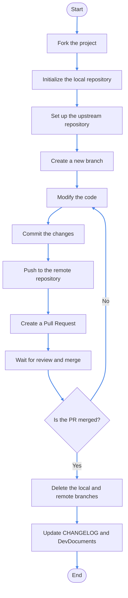

# Project Collaboration Tutorial

> This document provides a brief overview of how to initialize a project and collaborate using Git command line.

> You will need [Git](https://git-scm.com/downloads) for collaborative development.

## Initialize the Project

Minecraft Hunt uses Forge 1.20.1 - 40.2.20.

1. **Fork the project:**

Open the [Minecraft-Hunt GitHub repository](https://github.com/M1hono/Minecraft-Hunt), click the "Fork" button in the top right corner to fork the project to your GitHub account.

2. **Initialize the repository in your existing Minecraft instance folder:**

Open the command line or terminal, or directly execute the following commands in your Minecraft instance folder:

```bash
# Modify it to the actual path of your Minecraft instance, such as .minecraft or the version name in the launcher.
cd path/to/your/minecraft/instance
git init
# Using Minecraft-Hunt as an example, if you want to contribute code to it, you need to modify the repository code after forking.
# Replace YourUsername with your GitHub ID, you can directly use the forked repository link.
git remote add origin https://github.com/YourUsername/Minecraft-Hunt.git
git pull origin main
```

1. **Set up the upstream repository:**

To keep in sync with the original repository, set up the upstream repository:

```bash
git remote add upstream https://github.com/M1hono/Minecraft-Hunt.git
```

## Collaboration Workflow

4. **Create and switch to a new branch:**

First, it is recommended to create a new feature branch from the main branch:

```bash
git checkout -b feature-branch
```

1. **Modify the code:**

In your Minecraft instance folder, edit the project's code, resource files, or configuration files and make the necessary modifications and adjustments according to your needs.

2. **Commit the changes:**

After saving the modifications, use the following command to commit the changes to your local repository:

```bash
# Using 'git add .' should generally work fine, but you can replace '.' with the specific file path for added safety.
git add .
git commit -m "Describe your modifications"
```

1. **Push to the remote repository:**

If you are ready to merge your changes into the main branch, push your local branch to the remote repository:

```bash
git push
```

## Submitting a Pull Request (PR)

8. **Create a Pull Request:**

Open your forked GitHub repository page, select the feature branch you just pushed, click "Compare & pull request", fill in the relevant information, and submit the PR.

9. **Wait for review and merge:**

It is recommended to inform the developers in advance before submitting.

## Ending Collaboration

10. **Delete the local and remote branches:**

Once your PR is merged, you can safely delete the feature branch you created:

```bash
git checkout main
git branch -d feature-branch # Delete the local branch
git push origin --delete feature-branch # Delete the remote branch
```



## Guidelines

Whenever you perform the above steps, if your repository falls behind the original repository, click the `Sync fork` button to synchronize the progress.


::: details
> If you are contributing to Crychic's Minecraft-Hunt project, when you complete a task, you need to write your contribution in the CHANGELOG and DevDocuments.

> If you are an external developer contributing any content to Crychic's documentation, please leave your signature after adding the new item. Thank you very much for your contribution.

> For example: I completed this change => 2024/Month, Day - My Name
:::


<v-alert
    text="You are now a Pull Request master!"
    title="Congratulations!"
    type="success"
></v-alert>
