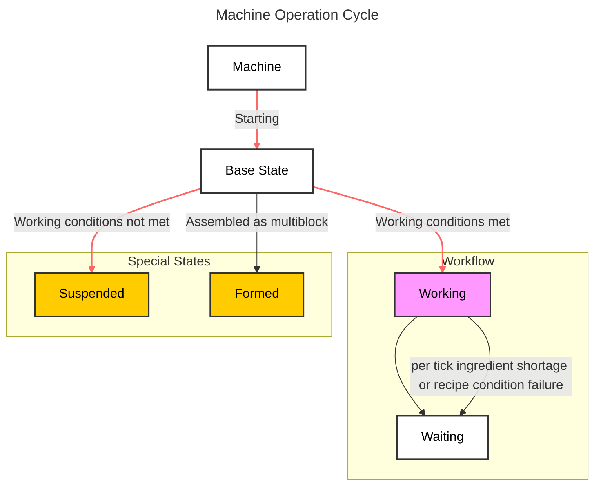

# Single Block Machine {#SingleBlockMachine}

`MBD2` provides two types of machines. This article briefly explains one of them and focuses on how to simply complete the functionality of a single block machine, without involving complex modules.

## Working State {#WorkingState}

Most effects in `MBD2` are designed and implemented based on the machine's state. You can see the specific logic through the state diagram below.

The state on the left is always the `parent` state of the state on the right. The `parent` state represents an inheritance relationship. Usually, some basic settings of the child class will ==inherit from the `parent class`==, such as model rendering, etc.

::: center

This can be simply understood as the **`brain`** of this machine.
:::

## Settings {#Options}

:::outlined
This section will focus more on the introduction of various modules and the general process of use. Not all parameters will be mentioned. More specific documentation can be viewed here (currently empty).
:::

Each module has three different `general configurators`:

1. [Basic Configuration](./SingleBlockBasicSettings): Generally the most basic configuration for a certain object, such as the `block properties` of the machine or the `event trigger nodes` are the basic configurations of the module, while basic elements like `UI` are also modified using the basic configurator.

2. [Other Configuration](): Generally the unique configuration of a certain object, for example, when configuring a single working state in the basic settings, other configurations will be opened.

3. [Resource Configuration](): Double-click on `Rendering`, `Texture`, or `Color` in the resource area to configure these resources individually.

Each module has different configurator functions and different configuration items. At the same time, ==when the item the player is configuring does not have a corresponding configurator, the configurator will not display any options==.
