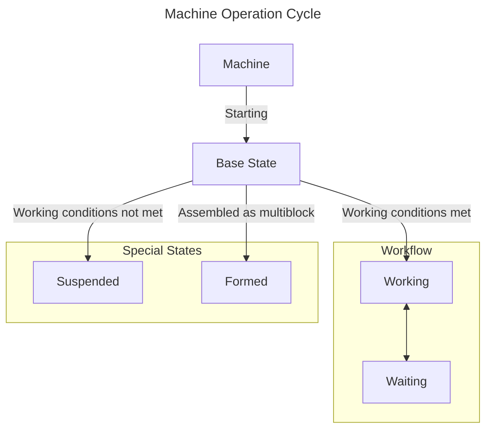

# Single Block Machine {#SingleBlockMachine}

:::::: justify
`MBD2` provides two types of machines. This article briefly explains one of them and focuses on how to simply complete the functionality of a single block machine, without involving complex modules.

## Working State {#WorkingState}

Most effects in `MBD2` are designed and implemented based on the machine's state. You can see the specific logic through the state diagram below.

The state on the left is always the `parent` state of the state on the right. The `parent` state represents an inheritance relationship. Usually, some basic settings of the child class will ==inherit from the `parent class`==, such as model rendering, etc.

::: center

This can be simply understood as the **`brain`** of this machine.
:::

## Settings {#Options}

:::outlined
This section will focus more on the introduction of various modules and the general process of use. Not all parameters will be mentioned. More specific documentation can be viewed here (currently empty).
:::

Each module has three different `general configurators`:

1. [Basic Configuration](#BasicOptions): Generally the most basic configuration for a certain object, such as the `block properties` of the machine or the `event trigger nodes` are the basic configurations of the module, while basic elements like `UI` are also modified using the basic configurator.

2. [Other Configuration](): Generally the unique configuration of a certain object, for example, when configuring a single working state in the basic settings, other configurations will be opened.

3. [Resource Configuration](): Double-click on `Rendering`, `Texture`, or `Color` in the resource area to configure these resources individually.

Each module has different configurator functions and different configuration items. At the same time, ==when the item the player is configuring does not have a corresponding configurator, the configurator will not display any options==.

### Basic Settings {#BasicOptions}

This module can configure the [working state](#WorkingState) of the machine. Its `basic configuration` allows players to set the `block properties`, `item properties`, and `machine settings` of the machine.

#### Block Properties {#BlockProperties}

:::outlined
This configures the [`block properties`](https://minecraft.fandom.com/wiki/Block_states) of the machine. There are detailed tips for each property in the game, which can be obtained by ==moving the mouse over the question mark box==. Therefore, they are only listed here with necessary expansions.
:::

:::details Detailed Overview
| Property Name | Description | Options | Explanation |
|--------|------|------|------|
| `Use AO` | Whether to enable ambient occlusion rendering |`boolean`| When enabled, it can increase the details of block shadows, improving visual effects |
| `Rotation State` | Allowed rotation directions for the block | `ALL`: All directions `NONE`: Cannot rotate `NONE_Y_AXIS`: X, Z axis directions `Y_AXIS`: Only Y axis direction | Controls the placement direction of the block in the game |
| `Jas Collision` | Whether to enable collision detection |`boolean`| When enabled, players and other entities will not be able to pass through this block |
| `Dynamic Shape` | Whether to enable dynamic shape |`boolean`| May be related to the visual effects or physical behavior of the block |
| `Ignited by lava` | Whether the block can be ignited by lava |`boolean`| Affects the interaction between the block and lava |
| `Is Air` | Whether the block is treated as air |`boolean`| If true, this block will not block movement or placement |
| `Is Suffocating` | Whether the block causes entities to suffocate |`boolean`| If false, entities can breathe inside the block |
| `Emissive` | Whether the block emits light |`boolean`| When enabled, the block (texture) will glow in the dark |
| `Friction` | The friction coefficient of the block surface | `float` [0.0, 1.0] | 0.0 = No friction (extremely slippery) 1.0 = Maximum friction (extremely rough) |
| `Speed Factor` | Affects movement speed on the block | `float` [0.0, +∞) | 1.0 = Normal speed >1.0 = Acceleration (e.g., 1.5 = 50% acceleration) <1.0 = Deceleration (e.g., 0.5 = 50% deceleration) |
| `Jump Factor` | Affects jump height from the block | `float` [0.0, +∞) | 1.0 = Normal jump >1.0 = Increase jump height <1.0 = Decrease jump height |
| `Destroy Time` | Time required to destroy the block | `float` [0.0, +∞) seconds | 0.0 = Instant destruction Higher = Harder to destroy |
| `Explosion Resistance` | The block's ability to resist explosions | `float` [0.0, +∞) | 0.0 = No resistance Higher = More resistant to explosions |
| `Sound` | Sound played when interacting with the block | `SoundEvent` | Specifies the sound effect when the block is destroyed |
:::

#### Item Properties {#ItemProperties}

:::outlined
This configures the properties of the machine when it exists as an item. There are detailed tips for each property in the game, which can be obtained by ==moving the mouse over the question mark box==. Therefore, they are only listed here with necessary expansions.
:::

:::details
| Property Name | Description | Options | Explanation |
|--------|------|------|------|
| `Block Light` | Controls how the block is lit as an item in the GUI |`boolean`| `true`: The item will be lit on the side as a block `false`: The item will be lit on the front as an item |
| `GUI Item 3D` | Controls the rendering of the block as an item |`boolean`| Controls whether the item is displayed as a 3D model in the GUI |

:::
::::::
