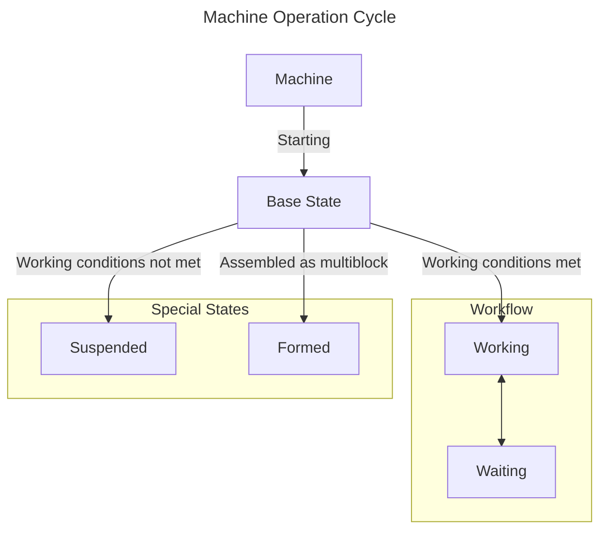

# Single Block Machine {#SingleBlockMachine}

`MBD2` provides two types of machines. This article briefly explains one of them and focuses on how to simply complete the functionality of a single block machine, without involving complex modules.

## Working State {#WorkingState}

Most effects in `MBD2` are designed and implemented based on the machine's state. You can see the specific logic through the state diagram below.

The state on the left is always the `parent` state of the state on the right. The `parent` state represents an inheritance relationship. Usually, some basic settings of the child class will ==inherit from the `parent class`==, such as model rendering, etc.

::: center

This can be simply understood as the **`brain`** of this machine.
:::

## Settings {#Options}

:::outlined
This section will focus more on the introduction of various modules and the general process of use. Not all parameters will be mentioned. More specific documentation can be viewed here (currently empty).
:::

Each module has three different `general configurators`:

1. [Basic Configuration](#BasicOptions): Generally the most basic configuration for a certain object, such as the `block properties` of the machine or the `event trigger nodes` are the basic configurations of the module, while basic elements like `UI` are also modified using the basic configurator.

2. [Other Configuration](): Generally the unique configuration of a certain object, for example, when configuring a single working state in the basic settings, other configurations will be opened.

3. [Resource Configuration](): Double-click on `Rendering`, `Texture`, or `Color` in the resource area to configure these resources individually.

Each module has different configurator functions and different configuration items. At the same time, ==when the item the player is configuring does not have a corresponding configurator, the configurator will not display any options==.

### Basic Settings {#BasicOptions}

This module can configure the [working state](#WorkingState) of the machine. Its `basic configuration` allows players to set the `block properties`, `item properties`, and `machine settings` of the machine.

#### Block Properties {#BlockProperties}

:::outlined
This configures the [`block properties`](https://minecraft.fandom.com/wiki/Block_states) of the machine. There are detailed tips for each property in the game, which can be obtained by ==moving the mouse over the question mark box==. Therefore, they are only listed here with necessary expansions.
:::

:::details Detailed Overview
| Property Name | Description | Options | Explanation | Reload Type |
|--------|------|------|------|------|
| `Render Type` | The block's render type | `SOLID`: Fully opaque rendering, suitable for **blocks that do not require any transparency effects**, such as stone and dirt. `CUTOUT`: Uses alpha testing without mipmapping, suitable for blocks that **require transparency effects** through the alpha channel, like leaves and iron bars. `CUTOUT_MIPPED`: Uses alpha testing with mipmapping enabled, suitable for **transparent blocks that need to maintain good texture performance at a distance**. `TRANSLUCENT`: Uses alpha blending for partial transparency, suitable for **blocks that require partial transparency effects**, such as glass and ice. | Controls the rendering method of the block | NEED TO RESTART |
| `Use AO` | Whether to enable ambient occlusion rendering |`boolean`| When enabled, it can increase the details of block shadows, improving visual effects | NO NEED TO RESTART | 
| `Rotation State` | Allowed rotation directions for the block | `ALL`: All directions `NONE`: Cannot rotate `NONE_Y_AXIS`: X, Z axis directions `Y_AXIS`: Only Y axis direction | Controls the placement direction of the block in the game | NEED TO RESTART |
| `Has Collision` | Whether to enable collision detection |`boolean`| When enabled, players and other entities will not be able to pass through this block | NEED TO RESTART |
| `Dynamic Shape` | Whether to enable dynamic shape |`boolean`| Allows setting the block's shape dynamically | NEED TO RESTART |
| `Ignited by lava` | Whether the block can be ignited by lava |`boolean`| Affects the interaction between the block and lava | NEED TO RESTART |
| `Is Air` | Whether the block is treated as air |`boolean`| If true, this block will not block movement or placement | NEED TO RESTART |
| `Is Suffocating` | Whether the block causes entities to suffocate |`boolean`| If false, entities can breathe inside the block | NEED TO RESTART |
| `Emissive` | Whether the block emits light |`boolean`| When enabled, the block (texture) will glow in the dark | NEED TO RESTART |
| `Friction` | The friction coefficient of the block surface | `float` [0.0, 1.0] | 0.0 = No friction (extremely slippery) 1.0 = Maximum friction (extremely rough) | NEED TO RESTART |
| `Speed Factor` | Affects movement speed on the block | `float` [0.0, +∞) | 1.0 = Normal speed >1.0 = Acceleration (e.g., 1.5 = 50% acceleration) <1.0 = Deceleration (e.g., 0.5 = 50% deceleration) | NEED TO RESTART |
| `Jump Factor` | Affects jump height from the block | `float` [0.0, +∞) | 1.0 = Normal jump >1.0 = Increase jump height <1.0 = Decrease jump height | NEED TO RESTART |
| `Destroy Time` | Time required to destroy the block | `float` [0.0, +∞) seconds | 0.0 = Instant destruction Higher = Harder to destroy | NEED TO RESTART |
| `Explosion Resistance` | The block's ability to resist explosions | `float` [0.0, +∞) | 0.0 = No resistance Higher = More resistant to explosions | NEED TO RESTART |
| `Sound` | Sound played when interacting with the block | `SoundEvent` | Specifies the sound effect when the block is destroyed | NEED TO RESTART |
| `Transparent Block` | Whether the block is glass-like |`boolean`| If true, the block will be transparent | NO NEED TO RESTART |
:::

#### Item Properties {#ItemProperties}

:::outlined
This configures the properties of the machine when it exists as an item. There are detailed tips for each property in the game, which can be obtained by ==moving the mouse over the question mark box==. Therefore, they are only listed here with necessary expansions.
:::

:::details Detailed Overview
| Property Name | Description | Options | Explanation | Reload Type |
|--------|------|------|------|------| 
| `Use Block Light` | Controls how the block is lit as an item in the GUI |`boolean`| `true`: The item will be lit on the side as a block `false`: The item will be lit on the front as an item | NO NEED TO RESTART |
| `Use GUI 3D` | Controls the rendering of the block as an item |`boolean`| Controls whether the item is displayed as a 3D model in the GUI | NO NEED TO RESTART |
| `Item Render` | Selects whether to customize the item's rendering |`boolean`| `true`: Select a separate rendering for this block `false`: Use the parent state of the machine as the default rendering | NO NEED TO RESTART |
| `Max Stack Size` | Sets the maximum stack size of the item |`int` [1,64]| The maximum stack size of the item | NEED TO RESTART |
| `Rarity` | Sets the rarity of the item |`Rarity`| The rarity of the item | NEED TO RESTART |
| `Tooltip` | Sets the tooltip of the item |List<`Tooltip`>| Used to set the tooltip of the item, also known as Lore. | NO NEED TO RESTART |
| `Slot Preview` | Used to preview the inventory |`none`| Used for preview only | none |
:::

#### Machine Settings {#MachineSettings}

:::outlined
This section configures the `Machine Settings`, allowing players to set the machine's attributes and recipes. Detailed tips can be obtained by ==moving the mouse over the question mark box==, so they are only listed here with necessary expansions.

This configuration does not require restarting the game.
:::

:::details Detailed Overview
| Property Name | Description | Options | Explanation |
|--------|------|------|------|
| `Machine Level` | Sets the machine's level |`int` [0, +∞)| Sets the machine's level, can be used for recipe conditions. |
| `Has GUI` | Whether to display GUI |`boolean`| If true, the machine will display a GUI |
| `Has Recipe Logic` | Whether to enable recipe logic |`boolean`| `false`: The machine will not process recipes. If the machine doesn't need to process recipes, set to false to optimize performance. |
| `Recipe Damping Value` | Sets the recipe damping value |`int` [0.0, +∞) | If recipe processing is waiting, the damping value is the number of ticks the current progress decreases. |
| `Recipe Type` | Sets the machine's recipe type |`RecipeType`| Sets the corresponding recipe for the machine. |
| `Recipe Modifiers` | Adds and modifies recipe modifiers |List<`RecipeModifier`>| Used to modify `self/controller` recipes in real-time, can be used to create `upgrade/plugin` components|

- Content Modifier: Used for modifying recipe content. For example, item quantities, fluid amounts, etc.

|  |  |  |  |
|--------|------|------|------|
| `Multiplier` | Sets the modifier multiplier |`float` [0.0, +∞)| Multiplier for recipe content quantities |
| `Addition` | Sets the modifier addition |`float` [0.0, +∞)| Addition for recipe content quantities |
| `Target Content` | Modifies working method |`option`| `in`: Input content `out`: Output content `both`: Input and output content |

- Duration Modifier: Used for modifying recipe duration.

|  |  |  |  |
|--------|------|------|------|
| `Multiplier` | Sets the modifier multiplier |`float` [0.0, +∞)| Multiplier for recipe duration |
| `Addition` | Sets the modifier addition |`float` [0.0, +∞)| Addition for recipe duration |

- Maximum Parallel: This value is the maximum number of recipes the machine can process at the same time, don't set it too high.

|  |  |  |  |
|--------|------|------|------|
| `Multiplier` | Sets the modifier multiplier |`float` [0.0, +∞)| Multiplier for maximum parallel |
| `Addition` | Sets the modifier addition |`float` [0.0, +∞)| Addition for maximum parallel |

|  |  |  |  |
|--------|------|------|------|
| `MultiBlock Part Settings` | Sets multiblock part |`boolean`| `false`: The machine will not run as a normal single block. `true`: The machine will support running as a multiblock part on a single block. |
:::

#### Formed Machine Settings {#FormedMachineSettings}

:::outlined
This section configures the `Formed Machine Settings`, allowing players to set the machine's `multiblock parts`.
:::

::::details Detailed Overview
| Property Name | Description | Options | Explanation |
|--------|------|------|------|
| `Can Share` | Whether it can be shared |`boolean`| Whether this part can be shared among multiple multiblock machines |
| `Recipe Modifiers` | Adds and modifies recipe modifiers |List<`RecipeModifier`>| Used to modify `self/controller` recipes in real-time, can be used to create `upgrade/plugin` components|

- **Content Modifier**: Used for modifying recipe content. For example, item quantities, fluid amounts, etc.

|  |  |  |  |
|--------|------|------|------|
| `Multiplier` | Sets the modifier multiplier |`float` [0.0, +∞)| Multiplier for recipe content quantities |
| `Addition` | Sets the modifier addition |`float` [0.0, +∞)| Addition for recipe content quantities |
| `Target Content` | Modifies working method |`option`| `in`: Input content `out`: Output content `both`: Input and output content |

- **Duration Modifier**: Used for modifying recipe duration.

|  |  |  |  |
|--------|------|------|------|
| `Multiplier` | Sets the modifier multiplier |`float` [0.0, +∞)| Multiplier for recipe duration |
| `Addition` | Sets the modifier addition |`float` [0.0, +∞)| Addition for recipe duration |

- **Maximum Parallel**: This value is the maximum number of recipes the machine can process at the same time, don't set it too high.

|  |  |  |  |
|--------|------|------|------|
| `Multiplier` | Sets the modifier multiplier |`float` [0.0, +∞)| Multiplier for maximum parallel |
| `Addition` | Sets the modifier addition |`float` [0.0, +∞)| Addition for maximum parallel |

|  |  |  |  |
|--------|------|------|------|
| `Proxy Controller Capabilities` | Sets proxy controller capabilities |`boolean`| If the part doesn't contain the required capabilities, it will proxy capabilities from the controller's capabilities. |

- **Capability Filter**

|  |  |  |  |
|--------|------|------|------|
| `Trait Name Filter` | Sets trait name filter |`string`| Sets the trait name filter, only traits with matching names will be proxied. |
| `Capability IO` | Capability behavior for all sides of the machine |`boolean`| `BOTH`: Proxy both internal and external capabilities `NONE`: Don't proxy any capabilities `IN`: Only proxy input capabilities `OUT`: Only proxy output capabilities |

::: info
Directions include `Internal`, `Front`, `Back`, `Left`, `Right`, `Top`, `Bottom`.
:::

::: warning
If you set the top to `OUT-Output` for `Item Capability Trait`, the machine's top will only be able to be extracted from.
:::

::::