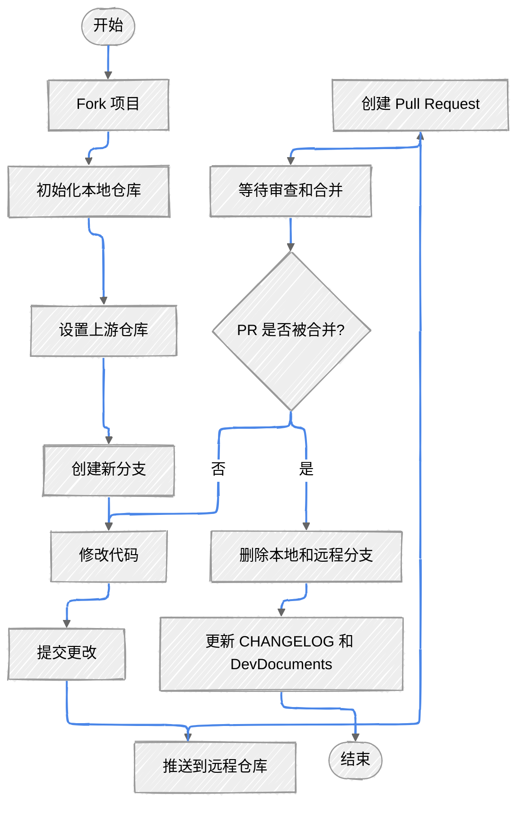

# 项目合作教程

> 本文简要概述了如何通过Git命令行来初始化项目并进行合作开发。

> 你需要[Git](https://git-scm.com/downloads)来进行合作开发。

## 初始化项目

1. **Fork 项目：**

打开你要进行内容修改的项目仓库，下文以CrychicDoc为例进行说明。

打开[CrychicDoc 仓库](https://github.com/PickAID/CrychicDoc)，点击右上角的 "Fork" 按钮，将项目 Fork 到你的 GitHub 账户中。

2. **初始化仓库：**
   
打开命令行或终端或直接在你的实例文件夹执行以下命令：

> 分别对应CrychicDoc的Github/gitee链接，如想为其他项目提供代码则请查看第三条。

> [!CAUTION] 注意
> **请查看注释中的说明来修改指令，不要直接复制粘贴。**

::: code-group
```bash [git]
# 修改为项目的文件夹地址。
# 在这种情况下，输入您想要存放CrychicDoc代码的文件夹。
cd path/to/your/project
git init # [!code focus]
# 此处以CrychicDoc举例，要为它提供代码的话，需要修改拉取fork后的仓库代码。
# 将YourUsername修改为你的GithubID，你可以直接使用fork后的仓库链接。
git remote add origin https://github.com/YourUserName/CrychicDoc.git # [!code focus]
git pull origin main # [!code focus]
```

```bash [git]
# 修改为项目的文件夹地址。
# 在这种情况下，输入您想要存放CrychicDoc代码的文件夹。
cd path/to/your/project
git init # [!code focus]
# 修改为实际的文件夹地址。
# 将YourUsername修改为你的GithubID，你可以直接使用fork后的仓库链接。
git remote add origin https://gitee.com/YourUsername/CrychicDoc.git # [!code focus]
git pull origin main # [!code focus]
```

```bash [git]
# 修改为项目的文件夹地址。
# 在这种情况下，输入您想要存放CrychicDoc代码的文件夹。
cd path/to/your/project
git init # [!code focus]
# 此处以CrychicDoc举例，要为它提供代码的话，需要修改拉取fork后的仓库代码。
# 将YourUsername修改为你的GithubID，你可以直接使用fork后的仓库链接。
git remote add origin https://github.com/YourUsername/TheNameOfRepo.git # [!code focus]
git pull origin main # [!code focus]
```
:::

3. **设置上游仓库：**

为了保持与原始仓库的同步，设置上游仓库：

::: code-group
```bash [git]
git remote add upstream https://github.com/PickAID/CrychicDoc.git
```
:::

4. **配置Git大小写敏感（重要）：**

为了确保跨平台协作的一致性，请运行相应的设置脚本：

::: code-group
```bash [Linux/macOS/Git Bash]
./.git-setup/setup-git-case-sensitivity.sh
```

```cmd [Windows 命令提示符]
.git-setup\setup-git-case-sensitivity.bat
```

```powershell [Windows PowerShell]
.\.git-setup\setup-git-case-sensitivity.ps1
```
:::

> [!IMPORTANT] 重要
> 此步骤对于跨平台协作至关重要。它确保Git跟踪文件名的大小写变化，防止不同操作系统之间的冲突。更多详情请参见 `.git-setup/README.md`。

## 合作流程

5. **创建并切换到新分支：**

首先，建议从主分支创建一个新的特性分支：

::: code-group
```bash [git]
git checkout -b feature-branch
```
::: 

6. **修改代码：**

在你的Minecraft实例文件夹中，编辑项目的代码、资源文件或配置文件，根据你的需求进行修改和调整。

7. **提交更改：**

保存修改后，使用以下命令将更改提交到你的本地仓库：

::: code-group
```bash [git]
# 一般直接add .不会出现问题，但保险起见可以将.替换为具体的文件路径。
git add .
git commit -m "描述你的修改内容"
```
:::

8. **推送到远程仓库：**

如果你准备将你的更改合并到主分支中，将你的本地分支推送到远程仓库：

::: code-group
```bash [git]
git push
```
:::


## 提交 Pull Request (PR)

9. **创建 Pull Request：**

打开你 Fork 的 GitHub 仓库页面，选择你刚刚推送的特性分支，点击"Compare & pull request"，填写相关信息并提交PR。

10.  **等待审查和合并：**

最好能在提交前提前告知开发者。

## 结束合作

11. **删除本地和远程分支：**

一旦你的PR被合并，你可以安全地删除新建的特性分支：

::: code-group
```bash [git]
git checkout main
git branch -d feature-branch # 删除本地分支
git push origin --delete feature-branch # 删除远程分支
```
:::

::: details 工作流示意图





:::

## 规范

在每次进行上述步骤时，如果你的仓库落后于原仓库，请点击`Sync fork`按钮来同步进度。


::: details
> 如果你参与的项目为Crychic的Minecraft-Hunt，在你完成某项工作时，需要在CHANGELOG与DevDocuments中写入你所提供的贡献。<br/>
> 如果你作为外部开发者为Crychic尤其为CrychicDoc贡献了任何资料与文档的内容，请在新增事项后留下您的署名，非常感谢您的付出。<br/>
> 如果您希望规范自己在CrychicDoc中的署名使其更加得体。请联系我们。<br/>
> 例如：我完成了这个更改 => 2024/某月、某日 - 我的名字
:::

:::v-success 恭喜你！
你现在已经是Pull Request大师啦！
:::