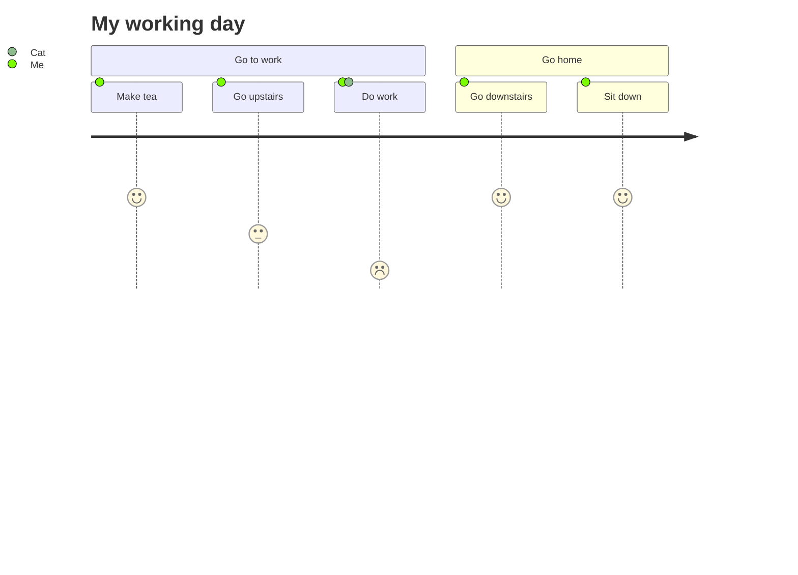

# 文档插件示例

## Mermaid示例

:::demo

:::

## 时间线插件示例

:::: demo 示例
::: timeline 2023-05-24
- **do some thing1**
- do some thing2
:::

::: timeline 2023-05-23
do some thing3
do some thing4
:::
::::

## B站视频示例

:::demo
<BilibiliVideo bvid="BV1rC4y1C7z2" />
:::

## 伤害静态图示例

:::demo

<DamageChart
  mode="static"
  :incomingDamage="20"
  :armorToughness="5"
  :minDamage="4"
  :maxDamage="20"
  :maxArmorPoints="20"
  :isJavaEdition="true"
/>

:::

## PDF Viewer

:::demo
<PdfViewer pdfSource="/pdf/modding/java/test.pdf"/>
:::

## 文件树

<!-- :::demo -->
<LiteTree>
A公司
    行政中心
        总裁办
        人力资源部      //+         增加标识     
        财务部          //+         增加标识
        行政部          //+         增加标识
        法务部
        审计部          //x         错误标识
        信息中心        //v         成功标识
    市场中心
        市场部
        销售部          //-         删除标识
        客服部          //-         删除标识
        品牌部          //-         删除标识
        市场策划部
        市场营销部      //!        代表强调
    研发中心
        移动研发部
        平台研发部      //*        修改标识
        测试部          //*        修改标识
        运维部          //*        修改标识
        产品部
        设计部
</LiteTree>
<!-- ::: -->