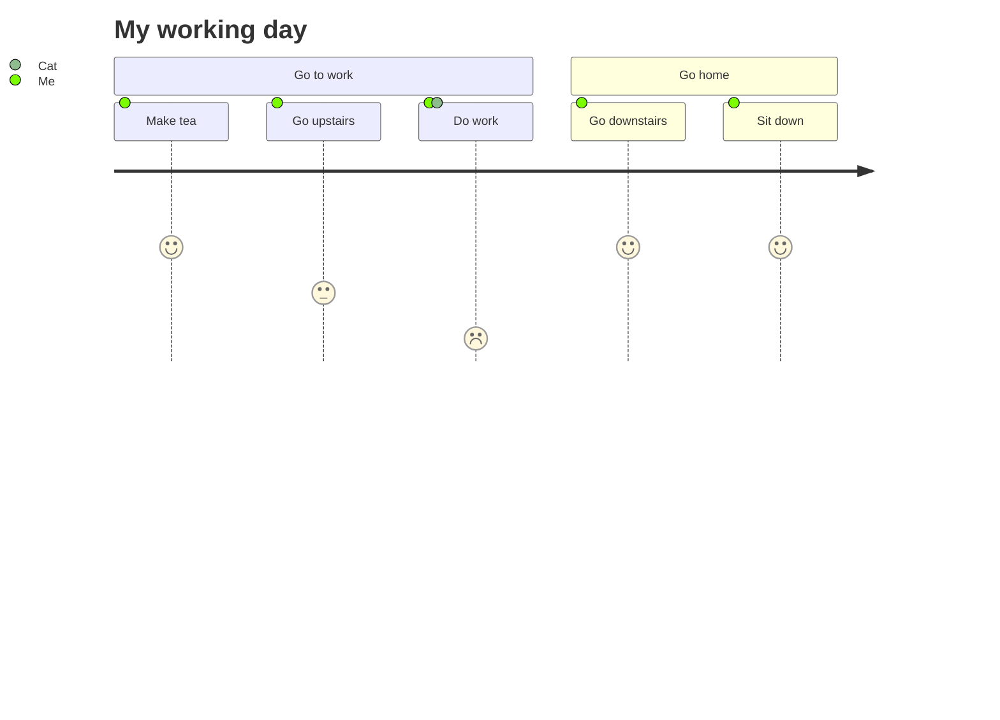

## Mermaid示例

<ClientOnly>

## 时间线插件示例

</ClientOnly>

::: timeline 2023-05-24
- **do some thing1**
- do some thing2
:::

::: timeline 2023-05-23
do some thing3
do some thing4
:::

## B站视频示例

<BilibiliVideo bvid="BV1rC4y1C7z2" />

## 伤害静态图示例

<ClientOnly>
<DamageChart
  mod="static"
  :incomingDamage="20"
  :armorToughness="5"
  :minDamage="4"
  :maxDamage="20"
  :maxArmorPoints="20"
  :isJavaEdition="true"
/>
</ClientOnly>