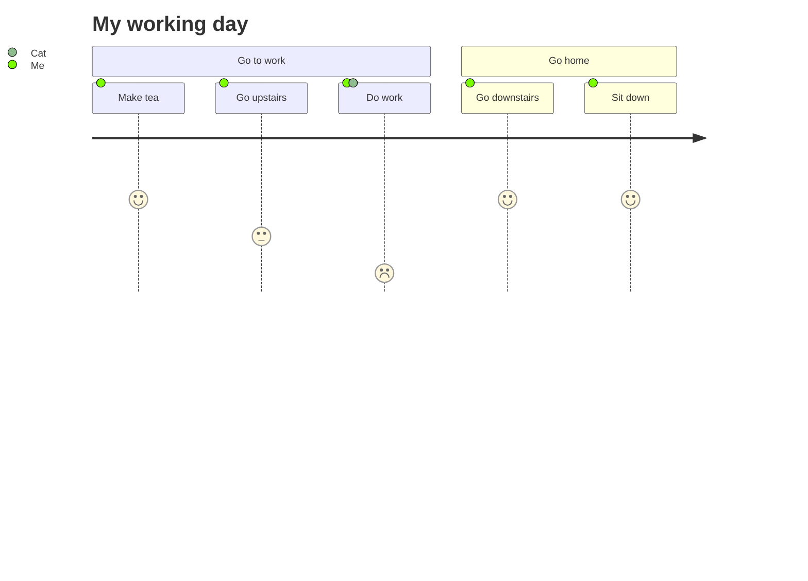

# 文档插件示例

## Mermaid示例

:::demo




:::


## Magic Move


::::demo
:::magic-move
```js [KubeJS]
BlockEvents.rightClicked("minecraft:oak_planks", (event) => {
    let player = event.getPlayer();
    if (event.getBlock().is("stone")) {
        let spawnItem = event.getLevel().createEntity("item");
        player.give("diamond");
    }
});
```
```java [Forge]
@SubscribeEvent
public void onBlockRightClick(PlayerInteractEvent.RightClickBlock event) {
  if (event.getWorld().getBlockState(event.getPos()).getBlock() == Blocks.STONE) {
    event.getPlayer().addItemStackToInventory(new ItemStack(Items.DIAMOND));
  }
}
```
:::
::::

## 时间线插件示例

:::: demo 示例
::: timeline 2023-05-24
- **do some thing1**
- do some thing2
:::

::: timeline 2023-05-23
do some thing3
do some thing4
:::
::::

## B站视频示例

:::demo
<BilibiliVideo bvid="BV1rC4y1C7z2" />
:::

## 伤害静态图示例

:::demo

<DamageChart
  mode="static"
  :incomingDamage="20"
  :armorToughness="5"
  :minDamage="4"
  :maxDamage="20"
  :maxArmorPoints="20"
  :isJavaEdition="true"
/>

:::

## PDF Viewer

:::demo
<PdfViewer pdfSource="/pdf/modding/java/test.pdf"/>
:::

## 文件树

### 基础文件树

:::demo 基础示例
<LiteTree>
A公司
    行政中心
        总裁办
        人力资源部      //+         增加标识     
        财务部          //+         增加标识
        行政部          //+         增加标识
        法务部
        审计部          //x         错误标识
        信息中心        //v         成功标识
    市场中心
        市场部
        销售部          //-         删除标识
        客服部          //-         删除标识
        品牌部          //-         删除标识
        市场策划部
        市场营销部      //!        代表强调
    研发中心
        移动研发部
        平台研发部      //*        修改标识
        测试部          //*        修改标识
        运维部          //*        修改标识
        产品部
        设计部
</LiteTree>
:::

### 带变量和样式的文件树

:::demo 高级样式示例
<LiteTree>
// 定义样式变量
#important=color:red;font-weight:bold;background:#ffe6e6;padding:2px 6px;border-radius:3px;
#success=color:green;font-weight:bold;background:#e6ffe6;padding:2px 6px;border-radius:3px;
#warning=color:orange;background:#fff3e0;padding:2px 6px;border-radius:3px;
.folder=color:#1976d2;font-weight:500;
.file=color:#666;
// 定义图标变量
folder=data:image/svg+xml;base64,PHN2ZyB4bWxucz0iaHR0cDovL3d3dy53My5vcmcvMjAwMC9zdmciIHdpZHRoPSIxZW0iIGhlaWdodD0iMWVtIiB2aWV3Qm94PSIwIDAgMjQgMjQiPjxwYXRoIGZpbGw9ImN1cnJlbnRDb2xvciIgZD0iTTEwIDRIOGEyIDIgMCAwIDAtMiAydjEyYTIgMiAwIDAgMCAyIDJoOGEyIDIgMCAwIDAgMi0yVjhhMiAyIDAgMCAwLTItMmgtM2wtMi0yWiIvPjwvc3ZnPg==
file=data:image/svg+xml;base64,PHN2ZyB4bWxucz0iaHR0cDovL3d3dy53My5vcmcvMjAwMC9zdmciIHdpZHRoPSIxZW0iIGhlaWdodD0iMWVtIiB2aWV3Qm94PSIwIDAgMjQgMjQiPjxwYXRoIGZpbGw9ImN1cnJlbnRDb2xvciIgZD0iTTE0IDJINmEyIDIgMCAwIDAtMiAydjE2YTIgMiAwIDAgMCAyIDJoMTJhMiAyIDAgMCAwIDItMlY4bC02LTZtNCA5VjlsNCA0aC00WiIvPjwvc3ZnPg==
js=data:image/svg+xml;base64,PHN2ZyB4bWxucz0iaHR0cDovL3d3dy53My5vcmcvMjAwMC9zdmciIHdpZHRoPSIxZW0iIGhlaWdodD0iMWVtIiB2aWV3Qm94PSIwIDAgMjQgMjQiPjxwYXRoIGZpbGw9IiNmN2RmMWUiIGQ9Ik0zIDNoMTh2MThIM1ptMTYuNTI1IDE0LjVjLS4zLS4zNTQtLjc5NS0uNjI5LTEuNzE3LS42MjljLS44ODEgMC0xLjQzOS4zMTgtMS40MzkuNzE4YzAgLjM5Ni4zNzMuNjM3IDEuMTU2Ljk2N2MxLjMzMi41ODYgMi4yODEgMS4wOTMgMi4yODEgMi4zOGMwIDEuMzItMS4yMDMgMi4xNDMtMi45NzQgMi4xNDNjLTEuMjEzIDAtMi4yNzEtLjQ2Mi0yLjk1LTEuMDc0bC44NzUtMS4yNzNjLjQzMy4zODkgMS4wNjQuNzI0IDEuNjY0LjcyNGMuNzA2IDAgMS4wNjQtLjMzMSAxLjA2NC0uNzMzYzAtLjQ0OS0uMzc2LS43MjQtMS4yNDUtMS4wMzNjLTEuMzI1LS40ODgtMi4xMzItMS4yNS0yLjEzMi0yLjM2M2MwLTEuMzk0IDEuMDI5LTIuMTQzIDIuODU2LTIuMTQzYzEuMDY0IDAgMS43NDUuMzI4IDIuMzc3Ljg1OWwtLjgzIDEuMjQxWm0tNS44NDUtLjMzNWMuMzY2LjgxNS4zNjYgMS41NzcuMzY2IDIuNDd2My45MDZoLTEuODc2VjE5LjZjMC0xLjUyNy0uMDYtMi4xOC0uNTUtMi40OGMtLjQxLS4yODgtMS4wNzYtLjI3NC0xLjYxOC0uMTA3Yy0uMzc4LjExNy0uNzEzLjMzNS0uNzEzIDEuMDc0djUuMDU2SDYuNDI3VjEyLjgyaDEuODc2djIuMTEzYy43NDctLjM5OSAxLjU3Ny0uNzM4IDIuNjQ1LS43MzhjLjc2NCAwIDEuNTc3LjI1MyAyLjA2OS43ODdjLjQ5OC41NTIuNjI2IDEuMTU3LjcyMyAxLjk5MVoiLz48L3N2Zz4=
---
[folder] {.folder}前端项目
    [folder] {.folder}src
        [folder] {.folder}components
            [file] {.file}Header.vue     // {#success}已完成
            [file] {.file}Footer.vue     // {#success}已完成
            [file] {.file}Sidebar.vue    // {#warning}开发中
        [folder] {.folder}pages
            [file] {.file}Home.vue       // {#success}已完成
            [file] {.file}About.vue      // {#important}需要重构
        [folder] {.folder}utils
            [js] {.file}api.js          // {#success}已完成
            [js] {.file}helpers.js      // {#warning}需要优化
    [file] {.file}package.json
    [file] {.file}README.md            // {#important}需要更新文档
</LiteTree>
:::

### 标准标记符示例

:::demo 标记符说明
<LiteTree>
项目状态检查
    已完成功能      //v    成功标记 (绿色对勾)
    新增功能        //+    添加标记 (绿色加号)
    已删除功能      //-    删除标记 (红色减号)
    发现错误        //x    错误标记 (红色X)
    修改文件        //*    修改标记 (橙色星号)
    重要项目        //!    重要标记 (红色感叹号)
</LiteTree>
:::

### 项目结构示例

:::demo 项目结构
<LiteTree>
// 样式定义
#new=color:white;background:#4caf50;padding:1px 4px;border-radius:2px;font-size:12px;
#deprecated=color:white;background:#f44336;padding:1px 4px;border-radius:2px;font-size:12px;
.important=font-weight:bold;color:#1976d2;
// 图标定义
vue=data:image/svg+xml;base64,PHN2ZyB4bWxucz0iaHR0cDovL3d3dy53My5vcmcvMjAwMC9zdmciIHdpZHRoPSIxZW0iIGhlaWdodD0iMWVtIiB2aWV3Qm94PSIwIDAgMjQgMjQiPjxwYXRoIGZpbGw9IiM0Y2FmNTAiIGQ9Ik0yIDIwaDIwTDEyIDR6Ii8+PC9zdmc+
ts=data:image/svg+xml;base64,PHN2ZyB4bWxucz0iaHR0cDovL3d3dy53My5vcmcvMjAwMC9zdmciIHdpZHRoPSIxZW0iIGhlaWdodD0iMWVtIiB2aWV3Qm94PSIwIDAgMTUgMTUiPjxwYXRoIGZpbGw9Im5vbmUiIHN0cm9rZT0iIzMxNzhDNiIgZD0iTTEyLjUgOHYtLjE2N2MwLS43MzYtLjU5Ny0xLjMzMy0xLjMzMy0xLjMzM0gxMGExLjUgMS41IDAgMSAwIDAgM2gxYTEuNSAxLjUgMCAwIDEgMCAzaC0xQTEuNSAxLjUgMCAwIDEgOC41IDExTTggNi41SDNtMi41IDBWMTNNMS41LjVoMTN2MTRIOS41eiIvPjwvc3ZnPg==
---
CrychicDoc
    .vitepress
        config           // {.important}配置目录
            index.ts     // {#new}新版配置
        plugins          // {.important}插件目录
            [ts] custom-alert.ts    // {#new}自定义警告插件
            [ts] dialog.ts          // {#new}对话框插件
        theme
            [vue] components        // {.important}组件库
                [vue] CustomAlert.vue    // {#new}警告组件
                [vue] Dialog.vue         // {#new}对话框组件
    docs
        zh               // 中文文档
            styleList.md // {#deprecated}需要更新
        en               // 英文文档
            samples.md   // {#new}示例文档
    [file] package.json
    [file] README.md     // {.important}项目说明
</LiteTree>
:::