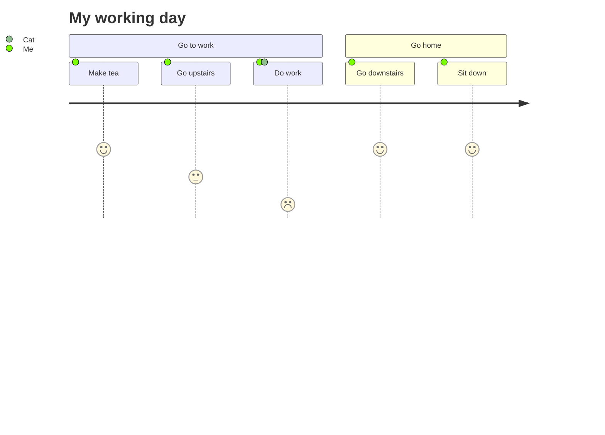

# 文档插件示例

## Mermaid示例

<ClientOnly>



## 时间线插件示例

</ClientOnly>

::: timeline 2023-05-24
- **do some thing1**
- do some thing2
:::

::: timeline 2023-05-23
do some thing3
do some thing4
:::

## B站视频示例

<BilibiliVideo bvid="BV1rC4y1C7z2" />

## 伤害静态图示例

<ClientOnly>
<!--  -->
<DamageChart
  mode="static"
  :incomingDamage="20"
  :armorToughness="5"
  :minDamage="4"
  :maxDamage="20"
  :maxArmorPoints="20"
  :isJavaEdition="true"
/>
</ClientOnly>

VuePress Theme Hope !!十分强大!!。

## Stepper插件示例

::: stepper
@tab 第一步
```yaml
---
noguide: true
root:
  title: example // [!code focus]
  collapsed: true
  subDir:
      - title: subDir a
        path: test
        collapsed: true
      - title: subDir back
        path: test
        noScan: true
        file: README
---
```

@tab 第二步
```yaml
---
noguide: true
root:
  title: example
  collapsed: true
  subDir: // [!code focus:4]
      - title: subDir a
        path: test
        collapsed: true
      - title: subDir back
        path: test
        noScan: true
        file: README
---
```

@tab 第三步
```yaml
---
noguide: true // [!code focus]
root:
  title: example
  collapsed: true
  subDir:
      - title: subDir a
        path: test
        collapsed: true
      - title: subDir back
        path: test
        noScan: true
        file: README
---
```
:::

