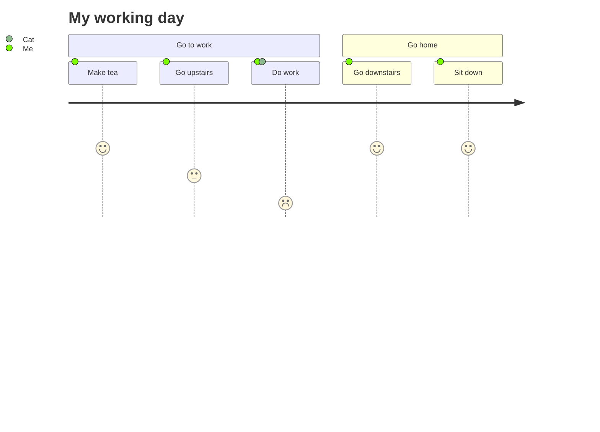

# 文档插件示例

## Mermaid示例

:::demo
<ClientOnly>

</ClientOnly>
:::

## 时间线插件示例

:::: demo 示例
::: timeline 2023-05-24
- **do some thing1**
- do some thing2
:::

::: timeline 2023-05-23
do some thing3
do some thing4
:::
::::

## B站视频示例

:::demo
<BilibiliVideo bvid="BV1rC4y1C7z2" />
:::

## 伤害静态图示例

:::demo
<ClientOnly>
<DamageChart
  mode="static"
  :incomingDamage="20"
  :armorToughness="5"
  :minDamage="4"
  :maxDamage="20"
  :maxArmorPoints="20"
  :isJavaEdition="true"
/>
</ClientOnly>
:::

## PDF Viewer

:::demo
<PdfViewer pdfSource="/pdf/modding/java/test.pdf"/>
:::