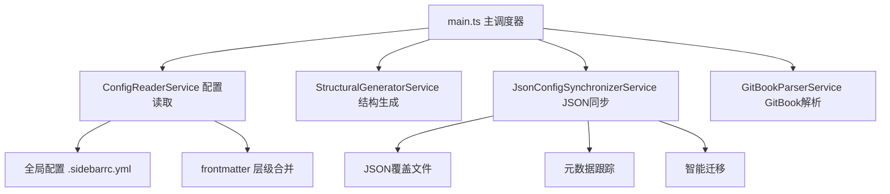
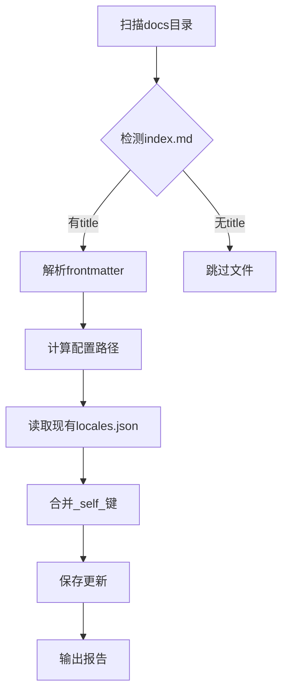
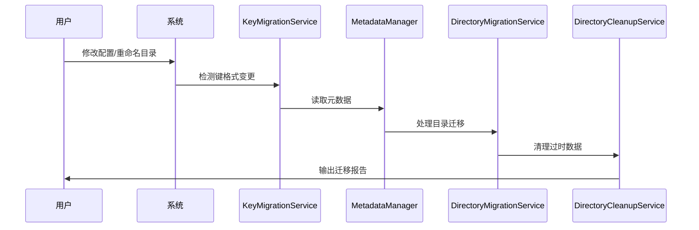

# VitePress 侧边栏生成器配置指南 {#guide}

## 简述 {#info}

本站使用自研的智能侧边栏生成系统，支持自动发现、配置继承、JSON 覆盖和智能迁移等高级特性。本文档将详解系统架构和配置方法。

## 系统架构 {#architecture}

### 核心服务组件



### 自动根节点发现

当目录中的 `index.md` 包含以下配置时：

```yaml
---
root: true # 启用根节点模式
title: 开发指南 # 侧边栏分组标题
---
```

系统会自动：

1. 🔍 **扫描发现**：通过 `findAllRootIndexMdPaths()` 发现所有根节点
2. 📂 **创建分组**：为每个根节点生成独立的侧边栏分组
3. ⚙️ **配置合并**：应用全局配置、层级 frontmatter 和 JSON 覆盖
4. 🗂️ **结构扁平化**：子目录内容直接展示，避免深层嵌套

### 文件扫描规则 {#scan-rules}

基于 `main.ts` 中 `findAllRootIndexMdPaths()` 的实际实现：

#### ✅ 包含的文件

-   所有 `.md` 文件（除系统保留文件）
-   子目录中的 `index.md`
-   GitBook 项目的 `SUMMARY.md`

#### 🚫 自动忽略项

```typescript
// 基于实际实现的忽略规则
const ignorePatterns = [
    "**/.vitepress/**", // VitePress系统目录
    "**/node_modules/**", // Node模块
    "**/_*/**", // 下划线开头的私有目录
    langGitbookPaths, // GitBook目录（单独处理）
];
```

#### 🎯 深度嵌套过滤

系统会自动过滤过深的嵌套根节点：

```typescript
// 防止过深嵌套的根节点冲突
const isMuchDeeper = depthFromLang > otherDepthFromLang + 2;
if (isWithinOther && isMuchDeeper) {
    // 过滤掉深层嵌套的根节点
}
```

## 配置系统 {#config-system}

### 配置优先级（实际合并顺序）


### frontmatter 配置 {#frontmatter}

基于 `types.ts` 中 `DirectoryConfig` 接口的完整配置选项：

| 配置字段    | 用途                 | 类型                                      | 默认值      | 实现位置               |
| ----------- | -------------------- | ----------------------------------------- | ----------- | ---------------------- |
| `root`      | 创建独立侧边栏根节点 | boolean                                   | `false`     | main.ts                |
| `title`     | 设置显示标题         | string                                    | 目录名      | ConfigReaderService    |
| `status`    | 内容状态             | 'published'\|'draft'\|'hidden'\|'noguide' | 'published' | EffectiveDirConfig     |
| `priority`  | 排序优先级           | number                                    | 0           | configDefaultsProvider |
| `maxDepth`  | 最大扫描深度         | number                                    | 3           | 全局配置               |
| `collapsed` | 默认折叠状态         | boolean                                   | `false`     | JSON 覆盖              |
| `itemOrder` | 子项排序规则         | Record<string,number>                     | `{}`        | 配置合并               |
| `groups`    | 分组配置             | GroupConfig[]                             | `[]`        | StructuralGenerator    |

#### 配置继承规则

```typescript
// 基于 ConfigReaderService.ts 的实际实现
for (const hIndexMdPath of hierarchyIndexMdPaths) {
    const frontmatter = await this.getFrontmatter(hIndexMdPath);
    const { root: _, ...frontmatterWithoutRoot } = frontmatter; // 排除root继承
    mergedConfig = deepMerge(mergedConfig, frontmatterWithoutRoot);
}
```

**注意**：`root` 属性不会被子目录继承，只在声明的目录生效。


### JSON 覆盖系统 {#json-overrides}

#### 覆盖文件类型

| 文件名           | 作用         | 数据结构                        | 处理服务              |
| ---------------- | ------------ | ------------------------------- | --------------------- |
| `locales.json`   | 显示标题覆盖 | `{"file.md": "自定义标题"}`     | JsonFileHandler       |
| `order.json`     | 排序控制     | `{"file.md": 1, "other.md": 2}` | JsonItemSorter        |
| `collapsed.json` | 折叠状态     | `{"dir/": true}`                | SyncEngine            |
| `hidden.json`    | 可见性控制   | `{"file.md": true}`             | RecursiveSynchronizer |

#### 配置路径映射

```bash
# 文档路径 → 配置路径转换规则（基于实际代码实现）
docs/zh/guide/index.md → .vitepress/config/sidebar/zh/guide/
docs/en/api/reference.md → .vitepress/config/sidebar/en/api/
```

#### 元数据跟踪机制

基于 `MetadataManager` 的实际实现，系统跟踪每个配置项：

```typescript
interface MetadataEntry {
    valueHash: string; // 配置值的MD5哈希
    isUserSet: boolean; // 用户自定义标记
    isActiveInStructure: boolean; // 在当前结构中是否活跃
    lastSeen?: number; // 最后更新时间戳
}
```

### 调试技巧 {#debugging}

#### 1. 查看配置合并过程

```bash
# 开启详细日志模式
DEBUG=sidebar:* npm run docs:dev
```

#### 2. 检查生成缓存

```bash
# 查看最终生成的侧边栏配置
cat .vitepress/config/generated/sidebars.json | jq '.'
```

#### 3. 元数据检查

```bash
# 查看特定目录的元数据
cat .vitepress/config/sidebar/.metadata/zh/guide/locales.meta.json
```

#### 4. 强制重建

```bash
# 清除缓存并重建
rm -rf .vitepress/cache && npm run docs:build
```

## 标题同步工具 {#title-sync}

### 🛠️ 实用工具说明

我们提供了强大的标题同步工具，可以自动将 `index.md` 文件中的 `title` 配置同步到对应的 `locales.json` 文件中：

#### 📦 命令使用

```bash
# 🎯 快速使用 - 更新所有语言
npm run update-titles

# 🎯 单一语言 - 只更新中文
npm run update-titles zh

# 🎯 多语言 - 更新指定语言
npm run update-titles en zh

# 🎯 查看帮助
npm run update-titles -- --help

# 🎯 直接使用脚本
node .vitepress/scripts/update-index-titles.mjs
```

#### 💡 工作原理



#### 🔧 实际示例

**处理前**：
```yaml
# docs/zh/guide/advanced/index.md
---
title: 高级指南
root: true
---
```

**自动同步后**：
```json
// .vitepress/config/sidebar/zh/guide/advanced/locales.json
{
  "_self_": "高级指南",
  "setup.md": "环境配置",
  "troubleshooting.md": "故障排除"
}
```

#### ✅ 智能特性

- **🎯 选择性处理**：只处理包含 `title` frontmatter 的 index.md 文件
- **🔒 数据保护**：完全保留 locales.json 中的其他配置项
- **📁 自动创建**：不存在的 locales.json 文件会自动创建
- **⚡ 增量更新**：只更新实际发生变化的文件
- **🛡️ 错误恢复**：单个文件出错不影响整体处理

#### 📊 执行报告示例

```bash
🔍 Scanning for index.md files with title configuration...

📁 Processing language: zh
==================================================
✓ Found index.md with title: zh/guide/advanced -> "高级指南"
✓ Found index.md with title: zh/api/reference -> "API参考"

Found 2 index.md files with titles
------------------------------
✓ Updated locales.json: .vitepress/config/sidebar/zh/guide/advanced/locales.json
  _self_: "高级指南"
- No change needed for: .vitepress/config/sidebar/zh/api/reference/locales.json

============================================================
📊 Summary:
   Scanned: 2 index.md files
   Updated: 1 locales.json files
✅ Index title update completed!
```

## GitBook 集成系统 {#gitbook}

### GitBook 自动检测

基于 `GitBookService` 的实现，系统会自动：

1. **检测 SUMMARY.md**：识别 GitBook 项目根目录
2. **排除冲突**：GitBook 目录不参与常规根节点扫描
3. **独立处理**：使用 `GitBookParserService` 专门解析
4. **路径清理**：自动处理 README.md 链接格式

#### GitBook vs 常规根节点

```typescript
// 基于main.ts的实际逻辑
const langGitbookPaths = await gitbookService.findGitBookDirectoriesInPath(
    currentLanguagePath
);

// GitBook路径会被排除在常规根节点扫描之外
const normalRootIndexMdPaths = await findAllRootIndexMdPaths(
    currentLanguagePath,
    nodeFs,
    langGitbookPaths // 传递GitBook路径进行排除
);
```

## 智能迁移系统 {#migration}

### 迁移架构



### 迁移服务组件

基于实际的迁移服务实现：

#### 1. KeyMigrationService

```typescript
// 键格式迁移：完整路径 → 相对路径
async migrateKeysRecursively(
    sidebarItems: SidebarItem[],
    rootSignature: string,
    lang: string,
    gitbookPaths: string[],
    docsPath: string
): Promise<boolean>
```

#### 2. DirectoryMigrationService

```typescript
// 处理目录重命名的数据迁移
async handleDirectoryMigrations(
    rootSignature: string,
    lang: string,
    activeSignatures: Set<string>,
    outdatedDirs: string[]
): Promise<boolean>
```

#### 3. DirectoryCleanupService

```typescript
// 清理不再使用的配置目录
async cleanupOutdatedDirectories(
    outdatedDirs: string[],
    lang: string
): Promise<void>
```

### 用户数据保护机制

```typescript
// 基于MetadataEntry的保护逻辑
if (metadata.isUserSet) {
    // 用户自定义配置永远被保护
    await migrateUserSetting(oldPath, newPath);
} else if (!metadata.isActiveInStructure) {
    // 只清理确认安全的系统生成数据
    await cleanupSystemData(oldPath);
}
```

### 迁移触发条件

1. **键格式升级**：检测到旧的完整路径键格式
2. **目录重命名**：对比目录签名识别重命名
3. **结构变更**：活跃目录集合发生变化
4. **清理请求**：过时元数据累积到阈值

## 性能优化 {#performance}

### 缓存策略

基于实际实现的缓存机制：

```typescript
// ConfigReaderService的缓存实现
private globalConfigCache: GlobalSidebarConfig | null | undefined = undefined;
private frontmatterCache: Map<string, Partial<DirectoryConfig>> = new Map();

public clearCache(): void {
    this.globalConfigCache = undefined;
    this.frontmatterCache.clear();
}
```

### 增量更新

```typescript
// UpdateTrackingService (计划中的优化)
if (
    !isDevMode &&
    !(await updateTracker.needsRegeneration([...allSourceFilePaths]))
) {
    return previouslyGeneratedSidebars; // 跳过不必要的重建
}
```

### 并行处理

```typescript
// 并行处理多个根节点
for (const rootIndexMdPath of normalRootIndexMdPaths) {
    // 每个根节点独立处理，可以并行化
    const structuralItems =
        await structuralGenerator.generateSidebarView(/*...*/);
    const finalItems = await jsonSynchronizer.synchronize(/*...*/);
}
```

## 最佳实践 {#best-practices}

### 1. 目录结构设计

```
docs/
├── zh/
│   ├── guide/
│   │   ├── index.md (root: true)
│   │   ├── getting-started.md
│   │   └── advanced/
│   │       ├── index.md (子级配置)
│   │       └── concepts.md
│   └── api/
│       └── index.md (root: true)
└── en/ (相同结构)
```

### 2. 配置策略

-   **优先使用 frontmatter**：简单配置写在 index.md 中
-   **JSON 用于细粒度控制**：复杂标题翻译使用 locales.json
-   **避免深层嵌套**：建议侧边栏深度 ≤3 层
-   **保持路径简洁**：利用扁平化特性减少目录层级

### 3. 迁移策略

-   **渐进式迁移**：分批次迁移配置，避免大规模变更
-   **备份元数据**：重要变更前备份.metadata 目录
-   **验证迁移结果**：使用调试命令确认迁移正确性

### 4. 调试工作流

```bash
# 1. 清除缓存
rm -rf .vitepress/cache

# 2. 检查配置合并
DEBUG=sidebar:config npm run docs:dev

# 3. 验证JSON覆盖
cat .vitepress/config/sidebar/zh/guide/locales.json

# 4. 检查元数据状态
find .vitepress/config/sidebar/.metadata -name "*.meta.json" -exec echo {} \; -exec cat {} \;
```

::: tip 开发技巧

1. **热重载限制**：JSON 配置文件修改需要手动重启开发服务器
2. **配置验证**：使用 TypeScript 接口确保配置类型正确
3. **路径规范化**：系统自动处理路径分隔符差异（Windows/Unix）
4. **错误恢复**：迁移失败时，系统会保守地保留原有配置

:::

::: warning 注意事项

-   **避免循环引用**：不要在嵌套目录中都设置 root: true
-   **GitBook 优先级**：GitBook 目录会跳过常规的 JSON 覆盖处理
-   **元数据一致性**：不要手动编辑.metadata 目录下的文件
-   **路径大小写**：确保文件路径大小写在不同操作系统间一致

:::

## 文档编写规范参考 {#rules-reference}

### 📚 最新编写规范

为了充分利用本侧边栏系统的强大功能，建议参考最新的[文档编写规范](./rules.md)，该文档已使用最新的LiteTree组件和样式系统进行了全面优化：

#### 🎨 现代化文档特性

<LiteTree>
// 新功能样式
#enhanced=color:white;background:#4caf50;padding:2px 6px;border-radius:3px;font-size:12px;
#visual=color:white;background:#2196f3;padding:2px 6px;border-radius:3px;font-size:12px;
#interactive=color:white;background:#ff9800;padding:2px 6px;border-radius:3px;font-size:12px;
---
文档编写规范新特性
    {#enhanced}LiteTree项目结构可视化              //+    交互式目录树
        彩色标记的文件类型                       // 配置、内容、脚本分类
        状态指示器支持                          // //+, //v, //!, //x 等
        自定义图标系统                          // TypeScript、JavaScript等图标
    {#visual}增强型警告组件                     //v    CustomAlert集成
        多种警告类型                           // info, warning, error, success
        自定义标题支持                          // 更好的信息层次
        主题自适应样式                          // 暗色/亮色主题
    {#interactive}智能文档导航                  //*    改进的用户体验
        侧边栏操作模式可视化                     // 两种配置方法对比
        文档结构层次图                          // H1-H4标题结构
        协作指南流程图                          // 内容创作最佳实践
</LiteTree>

#### ✨ 推荐使用的组件

- **📊 LiteTree**: 用于显示项目结构、工作流程、团队组织等
- **🔔 CustomAlert**: 用于重要提示、警告、成功消息等
- **📝 代码块**: 支持语法高亮的配置示例
- **🎯 表格**: 用于配置字段说明和对比

### 📋 侧边栏配置示例

参考规范文档的实际配置方式：

```yaml
---
title: VitePress 侧边栏配置指南
root: true
priority: 1
maxDepth: 3
---
```

## 开发特性状态 {#feature-status}

### 🔧 当前可用功能

:::alert {"type": "success", "title": "完全可用"}
- ✅ **智能侧边栏生成**: 全功能可用
- ✅ **LiteTree组件**: 项目结构可视化
- ✅ **CustomAlert组件**: 增强型提示框
- ✅ **Markdown扩展**: VitePress原生支持
- ✅ **主题切换**: 暗色/亮色自动适配
:::

### ⚠️ 计划中功能

:::alert {"type": "warning", "title": "开发中"}
**TwoSlash 类型补全功能目前暂不可用**。我们正在进行技术升级，该功能将在未来版本中重新启用。
:::

#### 🔮 TwoSlash 类型补全

该功能旨在为代码块提供TypeScript类型提示：

```typescript
// 计划中的效果
const config: SidebarConfig = {
    root: true,
    title: "指南"
//  ^? const config: SidebarConfig
};
```

**替代方案**: 
- 使用标准代码块语法高亮
- 在注释中手动添加类型说明
- 利用JSDoc风格的类型注解

#### 🚀 未来规划

- **实时预览**: 配置修改的即时预览
- **可视化编辑器**: 图形界面配置侧边栏
- **模板系统**: 预定义的侧边栏模板
- **导入导出**: 配置的批量管理功能

:::tip 开发建议

在等待TwoSlash功能恢复期间，推荐：
1. 使用详细的代码注释说明类型
2. 参考TypeScript官方文档示例
3. 利用IDE的内置类型提示功能

:::
