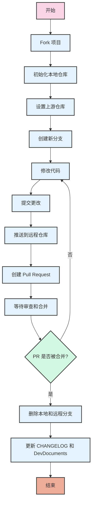

---
layout: docs

# 项目合作教程

> 本文简要概述了如何通过Git命令行来初始化项目并进行合作开发。

> 你需要[Git](https://git-scm.com/downloads)来进行合作开发。

## 初始化项目

Minecraft Hunt使用 Forge 1.20.1 - 40.2.20.

1. **Fork 项目：**

打开 [Minecraft-Hunt GitHub 仓库](https://github.com/M1hono/Minecraft-Hunt)，点击右上角的 "Fork" 按钮，将项目 Fork 到你的 GitHub 账户中。

2. **在现有的Minecraft实例文件夹中初始化仓库：**
   
打开命令行或终端或直接在你的Minecraft实例文件夹执行以下命令：

```bash
# 修改为实际的我的世界实例地址如.minecraft或启动器内的版本名称。
cd path/to/your/minecraft/instance
git init
# 将YourUsername修改为你的GithubID，你可以直接使用fork后的仓库链接。
git remote add origin https://github.com/YourUsername/Minecraft-Hunt.git
git pull origin main
```

1. **设置上游仓库：**

为了保持与原始仓库的同步，设置上游仓库：

```bash
git remote add upstream https://github.com/M1hono/Minecraft-Hunt.git
```

## 合作流程

4. **创建并切换到新分支：**

首先，建议从主分支创建一个新的特性分支：

```bash
git checkout -b feature-branch
```

1. **修改代码：**

在你的Minecraft实例文件夹中，编辑项目的代码、资源文件或配置文件，根据你的需求进行修改和调整。

2. **提交更改：**

保存修改后，使用以下命令将更改提交到你的本地仓库：

```bash
# 一般直接add .不会出现问题，但保险起见可以将.替换为具体的文件路径。
git add .
git commit -m "描述你的修改内容"
```

1. **推送到远程仓库：**

如果你准备将你的更改合并到主分支中，将你的本地分支推送到远程仓库：

```bash
git push
```


## 提交 Pull Request (PR)

8. **创建 Pull Request：**

打开你 Fork 的 GitHub 仓库页面，选择你刚刚推送的特性分支，点击“Compare & pull request”，填写相关信息并提交PR。

9.  **等待审查和合并：**

最好能在提交前提前告知开发者。

## 结束合作

10. **删除本地和远程分支：**

一旦你的PR被合并，你可以安全地删除新建的特性分支：

```bash
git checkout main
git branch -d feature-branch # 删除本地分支
git push origin --delete feature-branch # 删除远程分支
```

## 规范

在每次进行上述步骤时，如果你的仓库落后于原仓库，请点击`Sync fork`按钮来同步进度。

在你完成某项工作时，需要在CHANGELOG与DevDocuments中写入你所提供的贡献。

如果你是外部开发者的话，请在新增事项后留下你的名字。
    
例如：
> 我完成了这个更改 => 2024/某月、某日 - 我的名字