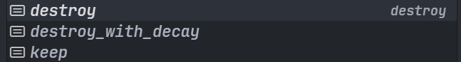

# LootJs
LootJs是一个`KubeJS`附属模组，它为`KubeJS`对于原版战利品列表修改进行了更方便的操作
`KubeJS`本身自带的修改Loot的方法过于繁琐，若要修改关于:
- 方块
- 实体
- 战利品列表

内的LootTable

推荐使用`LootJs`来实现

:::v-info
该篇教程源自于Github的官方Wiki

适用于Minecraft 1.19.2/1.20.1
:::

## 简介
Action用于更改当前战利品池结果或触发效果。您可以简单地将多个Action串联在一起。对于每个Loot Modification，您至少需要一个Action。

## 操作(基础)

### 添加战利品 
addLoot(...items){font-small}

将一个或多个添加`items`到当前战利品池中

以沙砾展开:
- `addBlockLootModifier`语句对沙砾进行LootTable修改
- `addLoot`对沙砾的LootTable进行添加

对于具体的LootType，请使用`ProbeJs`来进行补全提示

```js
LootJS.modifiers((event) => {
    // 修改方块
    event
        .addBlockLootModifier("minecraft:gravel")
        .addLoot("minecraft:flint")
    // 修改实体
    event
        .addEntityLootModifier("minecraft:pig")
        .addLoot("minecraft:diamond")
    // 修改原版战利品类型
    event
        .addLootTypeModifier('chest')
        .addLoot("minecraft:bedrock")
    
})
```

官方示例
```js
LootJS.modifiers((event) => {
    event.addBlockLootModifier("minecraft:oak_log").addLoot(
        /**
         * Creates a LootEntry with 50% chance of dropping a stick.
         */
        LootEntry.of("minecraft:stick").when((c) => c.randomChance(0.5)),
        /**
         * Creates a LootEntry with 50% chance of dropping a stick.
         */
        LootEntry.of("minecraft:apple").when((c) => c.randomChance(0.5))
    )
})
```

若要移除之前的掉落则加上↓这段代码在addLoot的上面
```js
.removeLoot("minecraft:flint")

```


根据Js的代码执行顺序，若将这串代码放置在addLoot底下则不会生效

必须放在addLoot的上面

若一个方块/实体/战利品列表里面有多个Loot
则可以使用
```js
.removeloot(Ingredient.all)
```

来将该方块/实体/战利品列表的所有Loot全部移除


### 添加替代战利品 

addAlternativesLoot(...items){font-small}

若要对一个方块添加多种Loot,且有概率随机,这时候就要用到`addAlternativesLoot`

根据 Minecraft Wiki：只会将第一个成功（满足条件）的物品添加到战利品池中。如果没有物品成功，则不会添加任何物品

- `addBlockLootModifier`语句进行对"minecraft:coal_ore"修改
- `removeLoot`语句内使用`Ingrediten.all`删除"minecraft:coal_ore"的所有Loot
- `addAlternativesLoot`进行LootTable列表修改

```js
LootJS.modifiers((event) => {
    event
        .addBlockLootModifier("minecraft:coal_ore")
        .removeLoot(Ingredient.all)
        .addAlternativesLoot(
            LootEntry.of("minecraft:apple").when((c) => c.randomChance(0.8)),
            LootEntry.of("minecraft:stick").when((c) => c.randomChance(0.3)),
            LootEntry.of("minecraft:diamond").when((c) => c.randomChance(0.7)),
            LootEntry.of("minecraft:coal").when((c) => c.randomChance(0.99)),
            LootEntry.of("minecraft:torch").when((c) => c.randomChance(0.2))
        )
})
```

相较于上方示例,直接在`addLoot`里面添加多种Loot有所区别

在`addLoot`里面添加多种Loot以及概率的时候是所有Loot都会根据你所设置的概率来进行掉落

而`addAlternativesLoot`是根据你设置的战利品条目，若一个条目的Loot触发后，则其他条目的Loot不会触发

相当于`addLoot`是所有Loot都会触发，`addAlternativesLoot`只会触发一个.


### **添加序列战利品**
addSequenceLoot(...items){font-small}

相较于`addAlternativesLoot`,`addSequenceLoot`的区别是
- 添加多个战利品列表，所有战利品列表都会生效
- 若一个Loot不触发，则停止该Loot往下进行的修改

这里的所有列表都会生效的意思是，当一个条目的战利品列表停止触发后，接下来往下对LootTable的修改将不会再进行
```js
LootJS.modifiers((event) => {
    event
        .addBlockLootModifier("minecraft:coal_ore")
        .removeLoot(Ingredient.all)
        .addSequenceLoot(
            LootEntry.of("minecraft:apple").when((c) => c.randomChance(0.8)),
            LootEntry.of("minecraft:stick").when((c) => c.randomChance(0.3)),
            LootEntry.of("minecraft:diamond").when((c) => c.randomChance(0.7)),
            LootEntry.of("minecraft:coal").when((c) => c.randomChance(0.99)),
            LootEntry.of("minecraft:torch").when((c) => c.randomChance(0.2))
        )
})
```

例如上述例子所示,若`minecraft:apple`触发并掉落,则接着触发`minecraft:stick`的Loot.

若`minecraft:stick`的Loot未触发,则该LootTable就不会进行下去，终止在掉落一个苹果，以此类推

若`minecraft:stick`触发，`minecraft:diamond`触发，`minecraft:coal`不触发则会掉落苹果，木棍，以及钻石(煤炭和火把则不会掉落)

以此类推

### 添加加权战利品
addWeightedLoot(NumberProvider, [...items]){font-small}

可以对任意方块/生物/战利品列表对于的Loot进行权重修改

以下的示例对`minecraft:creeper`进行展开:
- 使用`removeLoot`来删除原版所有的Loot.
- `addWeightedLoot`语句来添加加权战利品

::: code-group
```js [Example-1]
LootJS.modifiers((event) => {
    event
        .addEntityLootModifier("minecraft:creeper")
        .removeLoot(Ingredient.all)
        .addWeightedLoot(
            [1, 5],
            [Item.of("minecraft:gunpowder").withChance(20), Item.of("minecraft:nether_star").withChance(80)]
        )
})
```
```js [Example-2]
LootJS.modifiers((event) => {
    event
        .addEntityLootModifier("minecraft:creeper")
        .addWeightedLoot(5, [
            Item.of("minecraft:gunpowder").withChance(50),
            Item.of("minecraft:nether_star").withChance(50),
        ])
})
```
```js [Example-3]
LootJS.modifiers((event) => {
    event
        .addEntityLootModifier("minecraft:creeper")
        .addWeightedLoot([
            Item.of("minecraft:gunpowder").withChance(50),
            Item.of("minecraft:nether_star").withChance(5),
        ])
})
```
:::

`Example-1`:`[7,8]`的意思是对于`"minecraft:gunpowder"`以及`"minecraft:nether_star"`两个物品合起来的的掉落数量最少为7个，最多为8个

而`withChance(50)`规定在这7个或者8个掉落物当中各个物品的占比，上述示例的占比就各占了50%.而掉落物品的数量是随机的，在[7,8]之间随机抽取一个数字

`Example-2`:对于掉落物品数量还有另一种写法，相较于使用集合表示，你可以直接填写数字，则两个物品的掉落物数量总和就是5.两个物品掉落数量的权重依旧各占50%

`Example-3`:如果在`addWeightedLoot`中未指定掉落物品数量的时候，掉落物数量总和始终为集合[1,1]


### 删除战利品列表
removeLoot(ItemFilter){font-small}

上述我们在演示的时候已经提及到关于删除战利品列表的代码

在`removeLoot`语句中是一个物品选择器，即`ItemFilter`

例如:

- `removeLoot(ItemID)` 删除对应LootTable的ItemID
- `removeLoot(Ingredient.all)` 删除对应LootTable的所有Loot


```js
LootJS.modifiers((event) => {
    event.addBlockLootModifier("minecraft:gravel").removeLoot("minecraft:flint")
})
```

### 替换战利品
replaceLoot(ItemFilter, item){font-small}

replaceLoot(ItemFilter, item, preserveCount){font-small}

同样的在`replaceLoot`语句中也是一个ItemFilter
- `replace(originItemID,replaceItemID)`
- `replace(originItemID,replaceItemID,Boolean)`

在这个例子中，我们用钻石代替沙砾LootTable中的燧石。

::: code-group
```js [None]
LootJS.modifiers((event) => {
    event.addBlockLootModifier("minecraft:gravel").replaceLoot("minecraft:flint", "minecraft:diamond")
})
```

```js [Boolean]
LootJS.modifiers((event) => {
    event.addBlockLootModifier("minecraft:gravel").replaceLoot("minecraft:flint", "minecraft:diamond", true)//flase
})
```
:::

经过测试后，在`replaceLoot`语句后加Boolean值没有任何变化

### 修改战利品
modifyLoot(ItemFilter, callback){font-small}

修改煤炭矿石的LootTable
对于`modifyLoot`语句:
- `Ingredient.all`是个`ItemFilter`，用于指定该物品/生物/战利品列表要修改的物品
- 回调函数`ItemStack`修改`ItemFilter`的属性

下面的示例修改了煤矿所有的战利品列表(`Ingredient.all`)，回调函数ItemStack获取战利品列表里面的物品，设置了掉落物数量为2，返回新的ItemStack到煤炭矿石的战利品列表

```js
LootJS.modifiers((event) => {
    event
        .addBlockLootModifier('minecraft:coal_ore')
        .modifyLoot(Ingredient.all, (itemStack) => {
            itemStack.setCount(itemStack.getCount() * 2)
            return itemStack
        })
})
```

### 触发爆炸
triggerExplosion(radius, destroy, fire){font-small}

注意：该示例仅适用于`1.19.2`，对于`1.20.1`不兼容

在战利品生成的位置触发爆炸`triggerExplosion()`

`item`不会被摧毁，`radius`可以是任意的数字`float`，`destory`以及`fire`传入的参数都是`boolean`

```js
LootJS.modifiers((event) => {
    event
        .addBlockLootModifier("minecraft:gravel")
        .triggerExplosion(1, false, false)
})
```
对于1.20.1，`triggerExplosion()`的第二个传参变成了`$Explosion$BlockInteraction$Type`，不再是boolean.



下面是一个1.20.1的示例

```js
LootJS.modifiers(event=>{
    event
        .addBlockLootModifier('minecraft:coal_ore')
        .triggerExplosion(1,"destory",false)
})
```

### 触发雷电
triggerLightningStrike(shouldDamage){font-small}

在战利品生成的位置触发雷电`triggerLightningStrike()`

对于此方法，1.19.2以及1.20.1传入的参数都是`boolean`

```js
LootJS.modifiers(event=>{
    event
        .addBlockLootModifier('minecraft:gravel')
        .triggerLightningStrike(true)
})
```
### 掉落经验值
dropExperience(amount){font-small}

在战利品生成的位置会掉落对应的经验值`dropExperience()`

这里掉落的经验值是按`points`计算，而不是`level`

```js
LootJS.modifiers(event=>{
    event.addBlockLootModifier('minecraft:gravel').dropExperience(10)
})
```
### 战利品池修改
pool(callback){font-small}

针对某一生物/方块/战利品列表的战利品池进行修改

对`minecraft:creeper`的战利品池进行修改:
- 添加一个新的战利品池`pool`回调函数
- `rolls()`设置这个池子的掉落次数为 1 到 3 次（随机掉落，在集合[1,3]之间掉落）
- `randomChance()`设置一个 30% 的概率来触发这个掉落。
- `or(() => { })`来进行添加额外的条件，下列示例中使用回调函数`or`来进行修改
- `anyBiome()`满足条件在指定的生物群系中
- `lightLevel()`满足光照等级在`0-7`之间
- 若上述所有条件满足，使用`addLoot()`进行战利品池内物品添加

我们未对原版`minecraft:creeper`的战利品（火药）进行删除

最终我们会看到，在丛林生物群系中，光照等级为0-7之间的地方击杀`minecraft:creeper`后会掉落火药，以及1-3个不等的钻石（触发概率为30%）


```js
LootJS.modifiers((event) => {
    event.addEntityLootModifier("minecraft:creeper").pool((pool) => {
        pool.rolls([1, 3])
        pool.randomChance(0.3)
            .or((or) => {
                or.anyBiome("minecraft:jungle")
                or.lightLevel(0, 7)
            })
            .addLoot("minecraft:diamond")
    })
})
```
更多的方法请使用`ProbeJs`进行查询


### 玩家Action
playerAction(callback){font-small}

在进行战利品修改后可以对玩家的`Action`进行一些修改，例如：
- 给予玩家经验值
- 给予玩家物品

这里的回调函数是`LootJs`本身提供针对于`player`的类，而不是`KubeJS`的`player`类

```js
LootJS.modifiers((event) => {
    event.addBlockLootModifier("minecraft:diamond_block").playerAction((player) => {
        player.giveExperiencePoints(100)
        player.give('acacia_boat')
    })
})
```
上述代码中针对于`minecraft:diamond_block`进行了`Action`修改，玩家破坏钻石块生成了战利品后给予玩家100 points的经验值以及基于玩家一个金合欢木船

### apply应用
apply(callback){font-small}

对应的回调函数是`LootJs`提供的类`$LootContextJS`

更多关于`$LootContextJS`的方法请使用`ProbeJs`进行查看

下面的示例代码是在`minecraft:gravel`的战利品生成后获取该方块的`BlockPos`，最后在控制台的日志输出中打印出来


```js
LootJS.modifiers((event) => {
    event.addBlockLootModifier("minecraft:gravel").apply((context) => {
        let BlockPos = context.getBlockPos()
        console.log(BlockPos)
    })
})
```
输出的内容请见`logs/kubejs/server.log`
