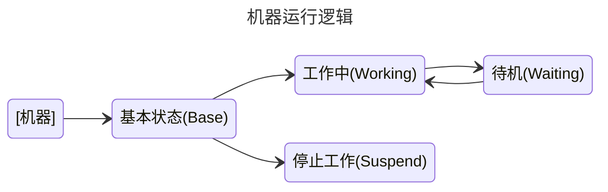

# 单方块机器

::: justify
`MBD2`提供了两种机器，本篇文章简单地讲解其中一种，并着重讲解如何简单地完善一个单方块机器的功能，不涉及复杂模块。

## 工作逻辑

```mermaid
---
title: 机器运行逻辑
---
stateDiagram-v2
    direction LR
    [机器] --> 基本状态(Base)

    基本状态(Base) --> 工作中(Working)
    工作中(Working) --> 待机(Waiting)
    待机(Waiting) --> 工作中(Working)
    基本状态(Base) --> 停止工作(Suspend)
```

:::