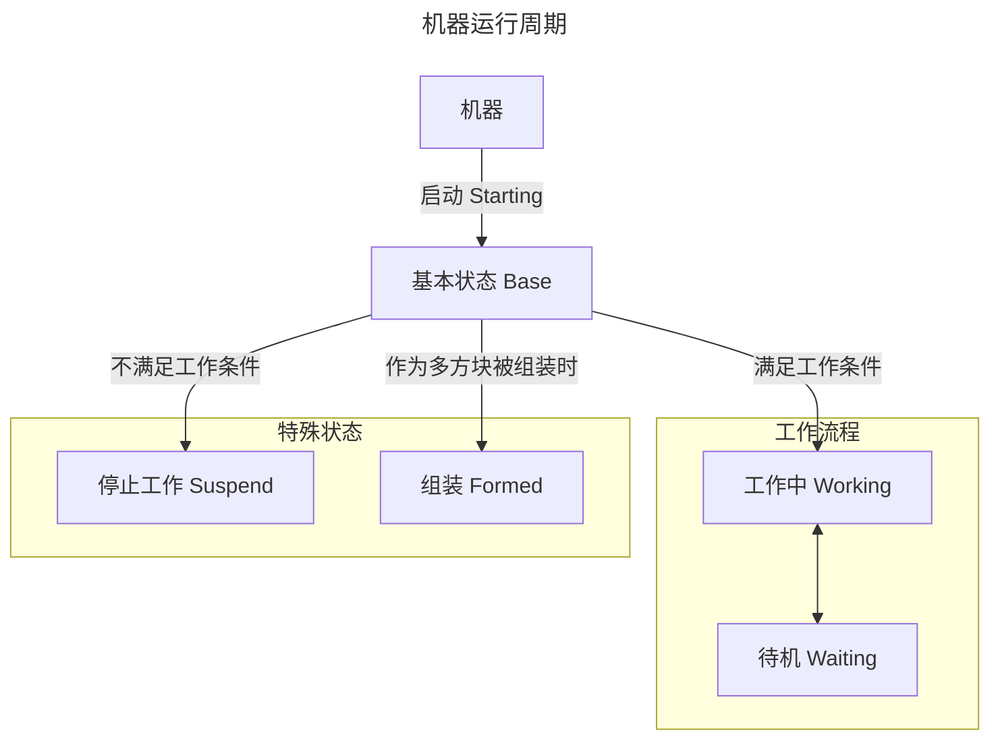

# 单方块机器 {#SingleBlockMachine}

:::::: justify
`MBD2`提供了两种机器，本篇文章简单地讲解其中一种，并着重讲解如何简单地完善一个单方块机器的功能，不涉及复杂模块。

## 工作状态 {#WorkingState}

`MBD2`的大部分效果都是基于机器的状态来设计与实现，可通过下方的状态图来看到具体的逻辑。

其中，左侧的状态永远是右侧状态的`父`状态，`父`状态所体现的是一种继承关系，通常情况下，子类的一些基本设置都会==沿用`父类`==，例如模型渲染等。

::: center

可以简单地将其理解为这个机器的 **`大脑`**。
:::

## 设置 {#Options}

:::outlined
该篇将更专注于各个模块的介绍与使用的大致流程，并非所有的参数都将被提及，更加具体的文档可在此处（暂空）查看。
:::

每个模块都有着三种不同的`通用配置器`：

1. [基础配置](#BasicOptions)：一般为某种物件最基本的配置，例如机器的`方块属性`或`事件的触发节点`为模块的基本配置，而`UI`这类基本元素也使用基本配置器进行修改。

2. [其他配置]()：一般是某种物件的独有配置，例如基本设置中对单个工作状态进行配置时就会打开其他配置。

3. [资源配置]()：双击资源区的`渲染`、`纹理`或`颜色`即可对这些资源进行单独的配置。

每个模块其各自的配置器功能都不同，并有着不同的配置项，同时，==当玩家正在配置的物品没有对应配置器时，配置器将不显示任何选项==。

### 基本设置 {#BasicOptions}

这个模块可以配置机器的[工作状态](#WorkingState)，其`基础配置`允许玩家设置该机器的`方块属性`、`物品属性`与`机器设置`

#### 方块属性 {#BlockProperties}

:::outlined
该处配置机器的[`方块属性`](https://minecraft.fandom.com/zh/wiki/%E6%96%B9%E5%9D%97%E7%8A%B6%E6%80%81)，游戏内部对每个属性都有着详细的提示，可通过将==鼠标移至问号框处获取==，因此只将它们列在此处并进行必要的拓展。
:::

:::details 详细一览
| 属性名 | 描述 | 选项 | 说明 |
|--------|------|------|------|
| `使用AO渲染 (Use AO)` | 是否开启环境光遮蔽渲染 |`boolean`| 开启后可增加方块阴影的细节,提高视觉效果 |
| `方块朝向 (Rotation State)` | 方块允许的旋转方向 | `ALL`: 所有方向 `NONE`: 无法旋转 `NONE_Y_AXIS`: X、Z 轴方向 `Y_AXIS`: 仅 Y 轴方向 | 控制方块在游戏中的放置方向 |
| `方块碰撞箱 (Jas Collision)` | 是否启用碰撞检测 |`boolean`| 开启后玩家和其他实体将无法穿过该方块 |
| `动态形状 (Dynamic Shape)` | 是否启用动态形状 |`boolean`| 可能与方块的视觉效果或物理行为有关 |
| `能被岩浆点燃 (Ignited by lava)` | 方块是否可被岩浆点燃 |`boolean`| 影响方块与岩浆的交互 |
| `可被忽略 (Is Air)` | 方块是否被视为空气 |`boolean`| 如果为 true,该方块将不会阻挡移动或放置 |
| `是否导致窒息 (Is Suffocating)` | 方块是否会导致实体窒息 |`boolean`| 如果为 false,实体可以在方块内呼吸 |
| `自发光 (Emissive)` | 方块是否会发光 |`boolean`| 开启后方块(的纹理）会在黑暗中发光 |
| `摩擦力 (Friction)` | 方块表面的摩擦系数 | `float` [0.0, 1.0] | 0.0 = 无摩擦力 (极滑) 1.0 = 最大摩擦力 (极粗糙) |
| `速度系数 (Speed Factor)` | 影响在方块上的移动速度 | `float` [0.0, +∞) | 1.0 = 正常速度 >1.0 = 加速 (如: 1.5 = 50%加速) <1.0 = 减速 (如: 0.5 = 50%减速) |
| `跳跃系数 (Jump Factor)` | 影响从方块上起跳的高度 | `float` [0.0, +∞) | 1.0 = 正常跳跃 >1.0 = 增加跳跃高度 <1.0 = 降低跳跃高度 |
| `摧毁时间 (Destroy Time)` | 破坏方块所需的时间 | `float` [0.0, +∞) 秒 | 0.0 = 立即破坏 越高 = 越难破坏 |
| `爆炸抗性 (Explosion Resistance)` | 方块抵抗爆炸的能力 | `float` [0.0, +∞) | 0.0 = 无抗性 越高 = 越能抵抗爆炸 |
| `声音 (Sound)` | 与方块交互时播放的声音 | `SoundEvent` | 指定方块被破坏时的音效 |
:::

#### 物品属性 {#ItemProperties}

:::outlined
该处配置机器作为物品存在时的属性，游戏内部对每个属性都有着详细的提示，可通过将==鼠标移至问号框处获取==，因此只将它们列在此处并进行必要的拓展。
:::

:::details
| 属性名 | 描述 | 选项 | 说明 |
|--------|------|------|------|
| `方块光照 (Use AO)` | 控制方块作为物品在 GUI 内被照亮的逻辑 |`boolean`| `true`：物品将以方块形式在侧边被照亮 `false`：物品将以物品形式在正面被照亮 |
| `GUI物品3D (Use AO)` | 控制方块作为物品的渲染 |`boolean`| 控制物品在 GUI 内是否作为 3D 模型显示 |

:::
::::::
