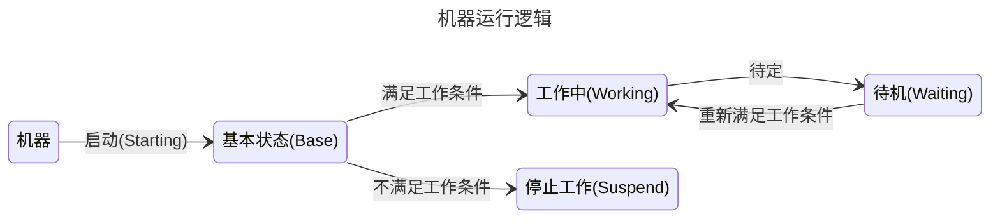

# 单方块机器 {#SingleBlockMachine}

::: justify
`MBD2`提供了两种机器，本篇文章简单地讲解其中一种，并着重讲解如何简单地完善一个单方块机器的功能，不涉及复杂模块。

## 工作状态 {#WorkingState}

`MBD2`的大部分效果都是基于机器的状态来设计与实现，可通过下方的状态图来看到具体的逻辑。

其中，左侧的状态永远是右侧状态的`父`状态，`父`状态所体现的是一种继承关系，通常情况下，子类的一些基本设置都会==沿用`父类`==，例如模型渲染等。

::: center
可以简单地将其理解为这个机器的 **`大脑`**。
:::
## 设置 {#Options}

`MBD2`将机器的配置分为了四个模块，分别允许玩家控制`模型`、`特性`、`事件`、`UI`。

该篇将更专注于各个模块的介绍与使用的大致流程，并非所有的参数都将被提及，更加具体的文档可在此处查看。

### 基本设定 {#BasicOptions}
:::