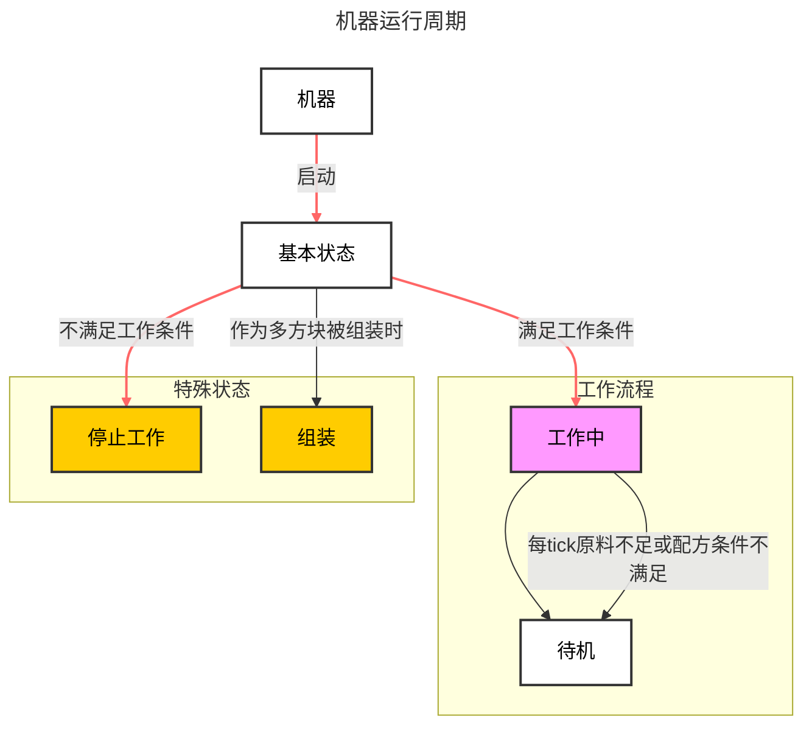

# 单方块机器 {#SingleBlockMachine}

`MBD2`提供了两种机器，本篇文章简单地讲解其中一种，并着重讲解如何简单地完善一个单方块机器的功能，不涉及复杂模块。

## 工作状态 {#WorkingState}

`MBD2`的大部分效果都是基于机器的状态来设计与实现，可通过下方的状态图来看到具体的逻辑。

其中，左侧的状态永远是右侧状态的`父`状态，`父`状态所体现的是一种继承关系，通常情况下，子类的一些基本设置都会==沿用`父类`==，例如模型渲染等。

::: center

可以简单地将其理解为这个机器的 **`大脑`**。
:::

## 设置 {#Options}

:::outlined
该篇将更专注于各个模块的介绍与使用的大致流程，并非所有的参数都将被提及，更加具体的文档可在此处（暂空）查看。
:::

每个模块都有着三种不同的`通用配置器`：

1. [基础配置](./SingleBlockBasicSettings)：一般为某种物件最基本的配置，例如机器的`方块属性`或`事件的触发节点`为模块的基本配置，而`UI`这类基本元素也使用基本配置器进行修改。

2. [其他配置]()：一般是某种物件的独有配置，例如基本设置中对单个工作状态进行配置时就会打开其他配置。

3. [资源配置]()：双击资源区的`渲染`、`纹理`或`颜色`即可对这些资源进行单独的配置。

每个模块其各自的配置器功能都不同，并有着不同的配置项，同时，==当玩家正在配置的物品没有对应配置器时，配置器将不显示任何选项==。